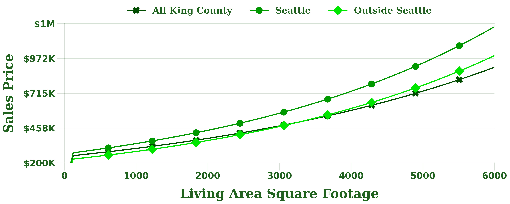

<h1 align='center'><strong><u>King County Development</u></strong></h1>
<p align="center">
    
</p>
<h3 align='center'><strong><em>An Academic Multiple Regression Analysis Project</em></strong></h3>
<h3 align='center'><strong><em>by <a href="www.linkedin.com/in/devin-sarnataro-0b639b148">Devin Sarnataro</a></em></strong></h3>
<h4 align='center'>October 2nd, 2022</h4>

# Repository Structure
```
- data
- images
- visuals
- Phase 2 - Project.ipynb
- Presentation.pptx
- README.md
- notebook.pdf
- pdf_presentation.pdf
```

# Table of Contents

- <a href="https://github.com/sarnadpy32/king_county_development#project-overview">Project Overview</a>
- <a href="https://github.com/sarnadpy32/king_county_development#stakeholder--business-problem">Stakeholder & Business Problem</a>
- <a href="https://github.com/sarnadpy32/king_county_development#understanding--preparing-the-data">Understanding & Preparing the Data</a>
    - <a href="https://github.com/sarnadpy32/king_county_development#three-models">Three Models</a>
- <a href="https://github.com/sarnadpy32/king_county_development#model-iterations">Model Iterations</a>
- <a href="https://github.com/sarnadpy32/king_county_development#insights-and-conclusions">Insights, Conclusions, and Recommendations</a>
    - <a href="https://github.com/sarnadpy32/king_county_development#visualizations-of-the-three-log-models">Visualizations of the Coefficients of the Three Log Models</a>
    - <a href="https://github.com/sarnadpy32/king_county_development#general-conclusions">General Conclusions</a>
    - <a href="https://github.com/sarnadpy32/king_county_development#picture-databases">Picture Databases</a>
    - <a href="https://github.com/sarnadpy32/king_county_development#sales-price-calculator">Sales Price Calculator</a>
- <a href="https://github.com/sarnadpy32/king_county_development#future-investigations">Future Investigations</a>

<a id='sect_proj_over'></a>

<h1 align='center'><strong><u>Project Overview</u></strong></h1>

This project’s purpose was to perform a multiple regression analysis to provide a client with a solution to a business problem.  I created a real estate developer named King County Development as a client.  For a specific business problem, I chose to determine which property features were significant to the sales price of a residential property and how much of an effect those features had on the sales price, individually and collectively.

Features deemed significant that positively affected the sales price would be desirable and worth investment. The opposite would be true for features deemed significant that negatively affected the sales price.  Knowing how much of an effect those features had on the sales price would allow King County Development to weigh the costs of specific renovations, remodeling, or construction against the potential increase in the sales price that would be achieved.

After exploring and appropriately modifying the data I was given, I built numerous multiple linear regression models to determine which features were statistically significant.  The features I chose to consider were the characteristics of a property that could be changed.  Whether a property is on the waterfront is not a feature that can be changed.  Of the features that remained, I analyzed how those features affected the sales price.  I then made recommendations based on the results of my analysis.

I analyzed my results to provide my <a href=”https://github.com/sarnadpy32/king_county_development#insights-and-conclusions”>Insights, Conclusions, and Recommendations</a>.  I offered specific standards that should be upheld while designing, renovating, or remodeling properties.  I recommended that <a href=”https://github.com/sarnadpy32/king_county_development#picture-databases”>Picture Databases</a> be created of properties grouped by essential features.  I built a <a href=”https://github.com/sarnadpy32/king_county_development#sales-price-calculator”>Sales Price Calculator</a> to quickly and easily show the change in the sales price based on the effect of a change in a feature and the impact of changes in multiple features.  After demonstrating the usefulness of such a tool, I recommended that King County Development build similar tools with more advanced capabilities.

While my recommendations were based on my analysis, the data I was given was limited in the period it covered.  Due to that fact, I also made a series of recommendations for any <a href=”https://github.com/sarnadpy32/king_county_development#future-investigations”>Future Investigations</a> to improve the performance of multiple linear regression models and the value of the insights gained through their use.  By doing so, King County Development could provide services and data analysis of the highest quality to their clients and investors and achieve high profits for themselves.

<a id='sect_bus_under'></a>

<h1 align="center"><b><u>Stakeholder & Business Problem</u></b></h1>

I chose a real estate developer as the stakeholder for this project.  While I could have chosen a real estate agency, a developer could better use the insights I gained through my analysis.  Real estate agencies would be limited by the desires of their client and the physical location of a client’s property.  Developers have more freedom in their decision-making regarding what changes to make to the properties they acquire and what properties to acquire in the first place.  They may ultimately rely on investors to purchase the property, but they will need an analysis like this to convince those investors of the value of a property or a design.  A real estate developer could also take on clients simply wanting renovations or remodeling services.  I named my hypothetical client King County Development.

As a real estate developer, King County Development would want to know which features of a property were important in determining the sales price of a residential property.  They would want to know whether those features affected the sales price positively or negatively.  They would also want to know the magnitude of those features’ effects on the sales price, individually and jointly.  

Knowing what features are important and their effect on the sales price is fundamental for a real estate developer to know.  Such knowledge would allow them to weigh the costs of renovating, remodeling, or constructing properties against the potential increase in the sales price that would be achieved.  It would be invaluable when pitching designs to investors or creating designs based on the resources of their clients.  My recommendations would help them:
-	Be profitable
-	Be efficient in their spending
-	Provide the highest quality services to their clients and investors

This is the business problem I chose to solve for King County Development.  I decided to determine the important features and the effects of those features.  I also chose to provide King County Development with the <a href=”https://github.com/sarnadpy32/king_county_development#sales-price-calculator”>Sales Price Calculator</a>, a tool I created so that they could quickly provide investors and clients with the benefits of any design in a precise dollar amount.

<a id='sect_data_under'></a>

<h1 align="center"><u>Understanding & Preparing the Data</u></h1>


<a href=”https://flatironschool.com/”>Flatiron school</a> provided me with a dataset of residential property sales in King County, Washington, for this project.  While they provided me with a <a href=”https://github.com/sarnadpy32/king_county_development/blob/master/data/column_names.md”>`.md` file</a> with a description of the columns, I also had to go to the King County Assessor’s <a href='https://info.kingcounty.gov/assessor/esales/Glossary.aspx?type=r'>glossary of terms</a> to understand the meaning of specific columns.  

Flatiron school provided me with a dataset of residential property sales in King County, Washington, for this project.  While they also provided me with a `.md` file with a description of the columns, I also had to go to the King County Assessor’s glossary of terms to understand the meaning of specific columns.

During my exploration, I discovered that the data only contained one year’s worth of property sales.  I replaced zip codes with the appropriate city names that I retrieved from the free dataset available on this site.  I also found that properties were sold multiple times during that year after I eliminated the possibility that they were duplicates or errors.  I eliminated outliers and columns that were either inappropriate for a multiple regression analysis or deemed unnecessary.  As I previously mentioned, I only kept property features that could be modified.

<a id='sect_three_models'></a>

<h2 align='center'><strong>Three Models</strong></h2>

While exploring the data, I found that it contained almost 9,000 residential properties in Seattle alone, far more than in any other city.  It would be beneficial to create three separate models, one for all of King County, one for properties inside of Seattle, and one for properties outside of Seattle.  The results of the models could then be compared, and essential insights could be revealed.  The distribution visualization I created that led to this decision can be seen below.

<br>
<p align='center'>
    
</p>

<a id='sect_model_iter'></a>

<h1 align='center'><strong><u>Model Iterations</u></strong></h1>

For each of the three models, I started by getting a baseline. I then created full models that included all possible features. I then began eliminating them to create a final model with only the best features. First, I removed features with high levels of multicollinearity. I then used machine learning to eliminate all but the best features. Finally, I eliminated all features with `pvalues` less than the standard confidence level of $0.05$ to include only the highest statistically significant features.

After checking to make sure the results met the requirements of linear regression, it was necessary to perform a log transformation of the target variable for each model to meet those requirements.  I then had a final equation that I could analyze to produce my <a href=”https://github.com/sarnadpy32/king_county_development#insights-and-conclusions”>Insights, Conclusions, and Recommendations</a>.  I transformed the coefficients in the equation to make understanding them more accessible.

<h2 align='center'><strong>Final Equations</strong></h2>

<h3 align='center'><strong>All King County Model</strong></h3>

```
price = 247106 +
0% * sqft_living +
6% * floors +
-2% * bedrooms +
-2% * bathrooms +
24% * renovated +
13% * basement +
-31% * grade_5_Fair +
-18% * grade_6_Low_Average +
20% * grade_8_Good +
42% * grade_9_Better +
61% * grade_10_Very_Good +
77% * grade_11_Excellent +
92% * grade_12_Luxury +
9% * condition_Good +
22% * condition_Very_Good
```

<h3 align='center'><strong>Seattle Model</strong></h3>

```
price = 266245 +
0% * sqft_living +
6% * floors +
-3% * bedrooms +
-3% * bathrooms +
15% * renovated +
7% * basement +
-33% * grade_5_Fair +
-22% * grade_6_Low_Average +
19% * grade_8_Good +
46% * grade_9_Better +
66% * grade_10_Very_Good +
82% * grade_11_Excellent +
82% * grade_12_Luxury +
14% * condition_Good +
23% * condition_Very_Good
```

<h3 align='center'><strong>Outside Seattle Model</strong></h3>

```
price = 221242 +
0% * sqft_living +
-6% * floors +
-1% * bedrooms +
4% * bathrooms +
26% * renovated +
-17% * grade_6_Low_Average +
21% * grade_8_Good +
42% * grade_9_Better +
58% * grade_10_Very_Good +
69% * grade_11_Excellent +
82% * grade_12_Luxury +
6% * condition_Good +
16% * condition_Very_Good
```

I also created simple dataframes with the coefficients, the $𝑟^2$, and the adjusted $𝑟^2$ scores from each model to make comparisons between the iterations easier.

<h2 align='center'><strong>Comparison Dataframes</strong></h2>

<h3 align='center'><strong>All King County Model</strong></h3>

|                     |   base   |    full     |  full_VIF  |  full_RFECV  |    fin     |  log  |
|:-------------------:|:--------:|:-----------:|:----------:|:------------:|:----------:|:-----:|
|        const        | -9971.04 | 1703859.53  | 154498.66  |  154081.19   | 154081.19  | 12.42 |
|     sqft_living     |  263.16  |   140.41    |   146.48   |    146.51    |   146.51   |  0.0  |
|       floors        |    -     |  22726.76   |  23217.92  |   23243.39   |  23243.39  | 0.06  |
|      bedrooms       |    -     |  -21777.63  | -23178.87  |  -23123.99   | -23123.99  | -0.03 |
|      bathrooms      |    -     |  -11206.55  |  -11716.3  |  -11679.28   | -11679.28  | -0.03 |
|      renovated      |    -     |  181119.06  | 181923.97  |  181930.52   | 181930.52  | 0.24  |
|      basement       |    -     |  69626.24   |  68594.06  |   68635.8    |  68635.8   | 0.13  |
|     grade_4_Low     |    -     | -1517768.34 | -45367.09  |      -       |     -      |   -   |
|    grade_5_Fair     |    -     | -1524888.40 | -55131.79  |  -54848.37   | -54848.37  | -0.32 |
| grade_6_Low_Average |    -     | -1504414.35 | -37038.44  |  -36835.73   | -36835.73  | -0.19 |
|   grade_7_Average   |    -     | -1465915.91 |     -      |      -       |     -      |   -   |
|    grade_8_Good     |    -     | -1385018.24 |  77346.95  |   77366.58   |  77366.58  |  0.2  |
|   grade_9_Better    |    -     | -1233625.54 | 224878.96  |  224842.46   | 224842.46  | 0.43  |
| grade_10_Very_Good  |    -     | -1024006.32 | 430919.78  |  430839.46   | 430839.46  | 0.61  |
| grade_11_Excellent  |    -     | -730707.33  | 719936.13  |  719795.31   | 719795.31  | 0.77  |
|   grade_12_Luxury   |    -     | -410107.78  | 1036957.95 |  1036795.91  | 1036795.91 | 0.93  |
|   condition_Fair    |    -     |  -77405.19  |  1475.96   |      -       |     -      |   -   |
|  condition_Average  |    -     |  -79715.71  |     -      |      -       |     -      |   -   |
|   condition_Good    |    -     |  -17962.22  |  60874.46  |   60830.85   |  60830.85  | 0.09  |
| condition_Very_Good |    -     |  65505.18   | 144022.38  |  144020.17   | 144020.17  | 0.23  |
|       r_score       |   0.47   |    0.60     |    0.59    |     0.59     |    0.59    | 0.58  |
|     r_adj_score     |   0.47   |    0.60     |    0.59    |     0.59     |    0.59    | 0.58  |

<h3 align='center'><strong>Seattle Model</strong></h3>

|                     |  base   |    full    |  full_VIF  |  full_RFECV  |    fin     |  log  |
|:-------------------:|:-------:|:----------:|:----------:|:------------:|:----------:|:-----:|
|        const        | 6025.12 | 718614.03  | 174482.27  |  174683.85   | 174683.85  | 12.49 |
|     sqft_living     | 294.04  |   184.66   |   187.29   |    187.3     |   187.3    |  0.0  |
|       floors        |    -    |  27634.74  |  27933.29  |   27889.48   |  27889.48  | 0.06  |
|      bedrooms       |    -    | -22775.69  | -23582.54  |  -23585.69   | -23585.69  | -0.03 |
|      bathrooms      |    -    | -23920.65  | -24081.66  |  -24093.65   | -24093.65  | -0.03 |
|      renovated      |    -    |  82079.33  |  82422.22  |   82342.85   |  82342.85  | 0.16  |
|      basement       |    -    |  15712.48  |  14859.01  |   14825.5    |  14825.5   | 0.07  |
|    grade_5_Fair     |    -    | -590885.08 | -45239.29  |  -44434.65   | -44434.65  | -0.33 |
| grade_6_Low_Average |    -    | -601699.90 | -56100.52  |  -55951.24   | -55951.24  | -0.23 |
|   grade_7_Average   |    -    | -545630.88 |     -      |      -       |     -      |   -   |
|    grade_8_Good     |    -    | -453898.98 |  90137.91  |   90095.61   |  90095.61  |  0.2  |
|   grade_9_Better    |    -    | -235354.60 |  307268.3  |  307233.45   | 307233.45  | 0.47  |
| grade_10_Very_Good  |    -    |  62677.45  | 603706.67  |  603709.83   | 603709.83  | 0.66  |
| grade_11_Excellent  |    -    | 453157.78  | 992514.98  |  992496.19   | 992496.19  | 0.82  |
|   grade_12_Luxury   |    -    | 605889.08  | 1143498.83 |  1143492.96  | 1143492.96 | 0.83  |
|   condition_Fair    |    -    |  9632.18   |  7250.82   |      -       |     -      |   -   |
|  condition_Average  |    -    |  1971.63   |     -      |      -       |     -      |   -   |
|   condition_Good    |    -    |  71790.87  |  69072.73  |   68935.18   |  68935.18  | 0.15  |
| condition_Very_Good |    -    | 131047.49  |  128206.3  |  128087.95   | 128087.95  | 0.23  |
|       r_score       |   0.5   |    0.66    |    0.66    |     0.66     |    0.66    |  0.6  |
|     r_adj_score     |   0.5   |    0.66    |    0.66    |     0.66     |    0.66    |  0.6  |

<h3 align='center'><strong>Outside Seattle Model</strong></h3>

|                     |   base    |    full     |  full_VIF  |  full_RFECV  |    fin    |  log  |
|:-------------------:|:---------:|:-----------:|:----------:|:------------:|:---------:|:-----:|
|        const        | -91819.36 | 1572682.14  | 134905.34  |  136007.95   | 133291.01 | 12.31 |
|     sqft_living     |  276.92   |   158.60    |   163.7    |    164.52    |  164.72   |  0.0  |
|       floors        |     -     |  -56699.56  | -58086.85  |   -60113.1   | -60315.98 | -0.07 |
|      bedrooms       |     -     |  -20231.90  | -21478.18  |  -21535.73   | -21441.37 | -0.02 |
|      bathrooms      |     -     |  30944.55   |  30521.39  |   31254.04   | 32069.22  | 0.05  |
|      renovated      |     -     |  240012.33  |  238588.9  |  238554.48   | 238464.61 | 0.26  |
|      basement       |     -     |   5653.46   |  3955.64   |      -       |     -     |   -   |
|     grade_4_Low     |     -     | -1274230.51 |  14331.81  |      -       |     -     |   -   |
|    grade_5_Fair     |     -     | -1311348.91 | -31293.35  |   -31772.7   |     -     |   -   |
| grade_6_Low_Average |     -     | -1304850.91 |  -27068.7  |  -27763.58   | -26189.38 | -0.17 |
|   grade_7_Average   |     -     | -1276829.89 |     -      |      -       |     -     |   -   |
|    grade_8_Good     |     -     | -1202304.02 |  71721.48  |   71620.96   |  71997.1  | 0.22  |
|   grade_9_Better    |     -     | -1078215.11 | 192902.31  |  192260.67   | 192295.88 | 0.42  |
| grade_10_Very_Good  |     -     | -896194.07  | 372210.28  |  371205.11   | 370825.14 | 0.58  |
| grade_11_Excellent  |     -     | -637499.77  | 627474.21  |  625882.61   | 624957.84 |  0.7  |
|   grade_12_Luxury   |     -     | -321870.82  | 940021.89  |  937667.39   | 936340.61 | 0.82  |
|   condition_Fair    |     -     | -174244.42  | -14624.14  |      -       |     -     |   -   |
|  condition_Average  |     -     | -160787.67  |     -      |      -       |     -     |   -   |
|   condition_Good    |     -     | -107988.52  |  51847.46  |   52185.95   | 52027.61  | 0.07  |
| condition_Very_Good |     -     |  -49586.81  | 109942.38  |  110270.99   | 109455.1  | 0.16  |
|       r_score       |   0.51    |    0.62     |    0.61    |     0.61     |   0.61    | 0.63  |
|     r_adj_score     |   0.51    |    0.62     |    0.61    |     0.61     |   0.61    | 0.63  |

After I had created the comparison dataframes for each of the models, I could analyze the performance of the models.

<h2 align='center'><strong>Analyzing Model Performance</strong></h2>

Unfortunately, the models I created could not be relied upon to predict the sales prices of a residential property. The $𝑟^2$ and the adjusted $𝑟^2$ scores never even broke a value of $.7$, meaning that the models were unreliable as predictive algorithms. I could have refined the models further to increase their predictive abilities, but I will discuss why I chose not to in the <a href=”https://github.com/sarnadpy32/king_county_development#future-investigations”>Future Investigations</a> section. While the <a href=”https://github.com/sarnadpy32/king_county_development#insights-and-conclusions”>Insights, Conclusions, and Recommendations</a> I gleaned from my analysis are certainly a first step, more data will need to be gathered if King County Development is to build a regression model that serves as a reliable predictive algorithm.

<a id='sect_insights_and_conclusions'></a>

<h1 align='center'><strong><u>Insights, Conclusions, and Recommendations</u></strong></h1>

By creating separate models, I was able to gain valuable insights.  I made a dataframe and visualizations with the coefficients of the three log-transformed models to quickly identify the differences between the predictors included in each model and their values.

You can see the markdown version of the final equation comparison dataframe for the three models below.

|                     |    kc     |  seattle  |  out_seattle  |
|:-------------------:|:---------:|:---------:|:-------------:|
|        const        | 247106.13 | 266245.11 |   221242.74   |
|     sqft_living     |   0.02%   |   0.03%   |     0.03%     |
|       floors        |   6.34%   |   6.19%   |    -6.65%     |
|      bedrooms       |  -2.86%   |  -3.07%   |    -1.82%     |
|      bathrooms      |  -2.83%   |  -3.23%   |     4.90%     |
|      renovated      |  24.36%   |  15.88%   |    26.15%     |
|      basement       |  13.09%   |   7.13%   |       -       |
|     grade_4_Low     |     -     |     -     |       -       |
|    grade_5_Fair     |  -31.92%  |  -33.28%  |       -       |
| grade_6_Low_Average |  -18.69%  |  -22.94%  |    -17.16%    |
|   grade_7_Average   |     -     |     -     |       -       |
|    grade_8_Good     |  20.21%   |  19.97%   |    21.86%     |
|   grade_9_Better    |  42.96%   |  46.72%   |    42.17%     |
| grade_10_Very_Good  |  61.30%   |  66.12%   |    58.11%     |
| grade_11_Excellent  |  77.40%   |  82.36%   |    69.67%     |
|   grade_12_Luxury   |  92.86%   |  82.82%   |    82.16%     |
|   condition_Fair    |     -     |     -     |       -       |
|  condition_Average  |     -     |     -     |       -       |
|   condition_Good    |   9.32%   |  14.86%   |     6.80%     |
| condition_Very_Good |  22.84%   |  23.14%   |    16.15%     |
|       r_score       |   0.582   |   0.596   |     0.628     |
|     r_adj_score     |   0.581   |   0.596   |     0.627     |

<a id='sect_viz_coeff'></a>

<h2 align='center'><strong>Visualizations of the Coefficients of the Three Log Models</strong></h2>

I used the visualizations I created in the presentation to my stakeholder.  I also used them to help guide my recommendations.  I made lists of columns to loop through to create the visualizations and styled each of them accordingly.

As the living area's square footage was not important per unit basis, it required a unique visualization to show its effect correctly.

<h3 align='center'><strong>Living Area Square Footage & Renovated</strong></h3>


<h3 align='center'><strong>Sales Price vs. Living Area Square Footage</strong></h3>


<h3 align='center'><strong>Floors, Bedrooms, Bathrooms & Basement</strong></h3>


<h3 align='center'><strong>Grade</strong></h3>


<h3 align='center'><strong>Condition</strong></h3>


<a id='reco_concl'></a>

<h2 align='center'><strong>General Conclusions</strong></h2>

It made sense that the square footage of the living area was included in all three models.  The more living space in the property, the more expensive the property.  Its effect on the sales price was exponential and dependent on both a starting point and a specific increase.  Therefore, any recommendation I provided would be arbitrary and its value limited.  This is the primary reason I built the <a href=”https://github.com/sarnadpy32/king_county_development#sales-price-calculator”>Sales Price Calculator</a>.  Using it, King County Development could easily show the effect of an increase in the square footage of the living area for any property.

While renovations may not be considered a feature that can be changed, the fact that they were included in all three models showed that they were important in determining the sales price.  Their positive effect also indicates that renovations can add significant value to a property.  However, the size of the effect varied between the models.  In the All King County and Outside Seattle models, renovations increased the sales price by around $25\%$.  In the Seattle model, the effect was lower at around $16\%$.  Regardless, this data can be used to prove to investors, clients, or the public via marketing that renovations make a difference.

The purpose of creating three separate models was to compare the results.  This was particularly interesting for the `floors`, `bathrooms`, and `basement` features.  They were similar in effect in the All King County and Seattle models.  In both models, the `floors` feature had a positive effect of around $6%$, while the `bathrooms` feature had a negative effect of about $3%$.  The `basement` feature had a positive effect in both models, but the effect was almost double in the All King County model compared to the Seattle model.  The `floors` and `bathrooms` features had the opposite effect in the Outside Seattle model, almost the exact opposite.  The fact that adding a `floor` Outside of Seattle had a negative effect was quite interesting. Still, the most interesting contradiction was that the `basement` feature wasn’t even included in the Outside Seattle Model.  

While the models contradicted each other in those three features, they were all aligned in that the `bedrooms` feature decreased the sales price in all three models.  This may be because you are decreasing the amount of living space by increasing the number of bedrooms and holding everything else constant.  The results for the `floors`, `bedrooms`, `bathrooms`, and `basement` features were perplexing and, unfortunately, did not lead to any actionable recommendations.  I will discuss how these results can be improved in the <a href=”https://github.com/sarnadpy32/king_county_development#future-investigations”>Future Investigations</a> section.

The most important feature by far was the `grade` of a property.  The categories in this feature resulted in the most significant changes in the sales price, both positively and negatively.  The `Average` `grade` was the point of zero effect and was not included in any of the models.  The categories above `Average` had increasingly positive effects, and the categories below it had increasingly negative effects, if they were included at all.  I recommend that King County Development at least design properties with a `grade` of `Better`, as it resulted in a significant increase of around $40\%$ in all three models and may be more attainable than the higher `grade`s.

The effect of the `condition` feature was also significant and followed a similar pattern as the `grade` feature. However, none of the categories below `Average` were included in any models.  This means that if King County Development is looking to increase the price of a property, it must attain a `Good` or `Very Good` `condition` if the property is not already in such a `condition.`  The `Very Good` `condition` is more desirable.

The importance of these features led to my recommendation to create <a href=”https://github.com/sarnadpy32/king_county_development#picture-databases”>Picture Databases</a>.  It was also difficult to recommend one `grade` or `condition` over another without knowledge of a property's original state.  This is another reason I created the <a href=”https://github.com/sarnadpy32/king_county_development#sales-price-calculator”>Sales Price Calculator</a>.  It, and any similar tool built by King County Development, allows recommendations to be adjusted for all properties.

<a id='reco_pic_dbs'></a>

<h2 align='center'><strong>Picture Databases</strong></h2>

Based on the results of my analysis and the visualizations I created, my first recommendation to King County Development would be to generate picture databases of properties grouped by their `grade`s and `condition`s.  The `grade` of a property was the most important feature in terms of its effect on the sales price.  The effect of the `condition` of the property, while not as important as `grade`, is another feature that can be easily documented with example pictures, and its effect was not insignificant.

The picture databases could be used while designing new properties, to justify a design’s building costs to investors, or to guide clients seeking renovation or remodeling services with a cost/benefit analysis.  Also, suppose a building or renovation did not obtain the desired `grade` or `condition` from the county assessor.  In that case, the picture databases could be used as evidence in any legal proceedings resulting from such an unwanted occurrence.

<a id='reco_sales_calc'></a>

<h2 align='center'><strong>Sales Price Calculator</strong></h2>

The visualizations I created help view each of the predictors' relative importance and compare the models themselves.  However, they do not provide a way to see how the predictors interact or what the final sales price would be when they do.  I built the Sales Price Calculator below to provide King County Development with a tool to show clients or investors how much of an increase can be gained by increasing the square footage while also upgrading the `grade` and `condition` of a property.

While the tool I created assumes that the property in question currently has both an `Average` `grade` and `condition`, more complex tools could and should indeed be built by King County Development in which the original `grade` and `condition` could also be included.

The first step in the version of the tool I created is entering a property's original square footage.  Next, you enter the increase in the square footage.  Once the user enters that information, a series of dropdown menus appear.  The first menu allows the user to choose which model is desired.  The original and the increase in the sales price are shown at this point.  The second and third menus allow the user to choose how much of an upgrade to the `grade` and `condition` of a property is desired.  After a choice is made in each dropdown, the increase in the sales price is shown, and after all the choices are made, the overall change in the sales price is also shown.

<a id='sect_fut_invest'></a>

<h1 align='center'><strong><u>Future Investigations</u></strong></h1>

Besides the picture databases I mentioned regarding the `grade`, `view`, and `condition` features, there is a lot more work that King County Development will need to perform if they want to be profitable, efficient in their spending and if they want to provide the highest quality services to their clients or investors. More valuable information can no doubt be gleaned from the dataset provided to me for this project, including testing interactions and building polynomial regression models. However, the dataset only covered one year’s worth of sales, so any further investigation would still be limited.

A much larger dataset, possibly with even more predictors to build models with, can undoubtedly be <a href='https://kingcountyexec.govqa.us/WEBAPP/_rs/'>obtained</a>.  Data on commercial property could also be gathered.  At that point, there should be enough data to create separate models for each city in King County and analyze the various ZIP codes within each city.  They should then develop maps of each city and ZIP code, separated by the appropriate zoning laws, to see what is possible in every inch of King County.

Areas of high potential should be identified, and the owners of any potentially lucrative properties should be approached to gauge their interest in purchasing their property or if they are at least interested in any renovation or remodeling services.  If not, King County Development will at least be fully prepared should any enticing properties become available or if they are approached for their other services.  The image below is from a video <a href='https://www.youtube.com/watch?v=ZeRd3aurWz8'>video</a> from the <a href='https://www.youtube.com/c/RealEstateforNoobs'>Real Estate for Noobs</a> YouTube channel, and the steps it shows are still only one small piece of the puzzle regarding real estate development.

<p align='center'>
    
</p>
