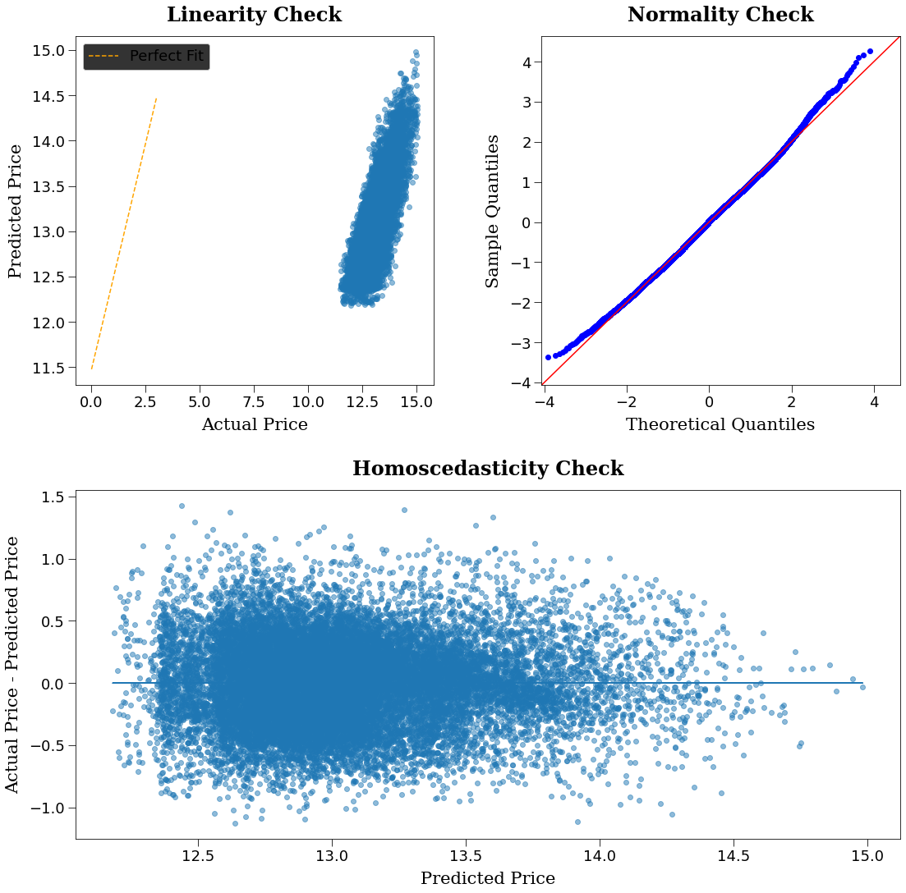
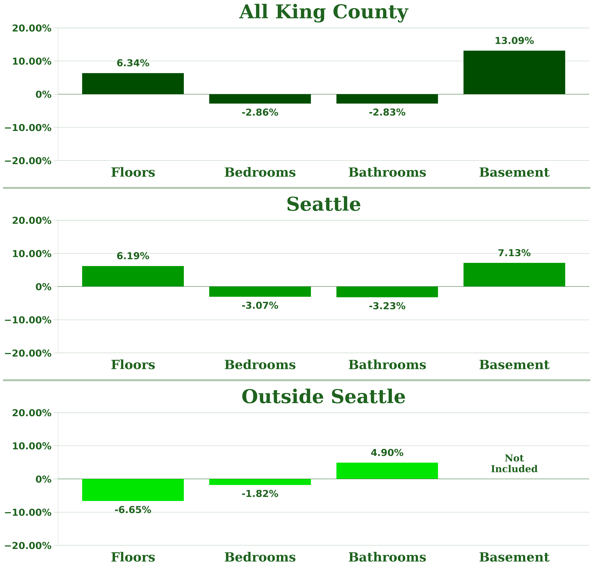

<h1 align='center'><strong><u>King County Development</u></strong></h1>
<p align="center">
    
</p>
<h3 align='center'><strong><em>An Academic Multiple Regression Analysis Project</em></strong></h3>
<h3 align='center'><strong><em>by <a href="www.linkedin.com/in/devin-sarnataro-0b639b148">Devin Sarnataro</a></em></strong></h3>
<h4 align='center'>September 7th, 2022</h4>

<table align="center" border="0" width='75%'>
    <td>
        
| Main Version | PDF Version |
| :-: | :-: |
| <a href="https://github.com/sarnadpy32/king_county_development/blob/master/Phase%202%20-%20Project.ipynb">Analysis</a> | <a href="https://github.com/sarnadpy32/king_county_development/blob/master/notebook.pdf">Analysis</a> |
| <a href="https://github.com/sarnadpy32/king_county_development/blob/master/Presentation.pptx">Presentation</a> | <a href="https://github.com/sarnadpy32/king_county_development/blob/master/pdf_presentation.pdf">Presentation</a> |</td>
    
</table>

<h1 align='center'><strong><u>Repository Structure</u></strong></h1>

```
├── data
├── images
├── visuals
├── Phase 2 - Project - yr_built changed.ipynb
├── Phase 2 - Project.ipynb
├── Presentation.pptx
├── README.md
├── notebook.pdf
├── pdf_presentation.pdf
```

<h1 align='center'><strong><u>Project Overview</u></strong></h1>

&nbsp;&nbsp;&nbsp;&nbsp;For this project, <a href='https://flatironschool.com/'>Flatiron School</a> provided me with a dataset of residential property sales in King County, Washington.
&ensp;We were instructed to create a hypothetical stakeholder, or client, and business problem, in contrast to the first project in which we were provided with both.
&ensp;For students who were struggling to define a stakeholder, they recommended a real estate agency that assists homeowners in selling their homes, with the specific business problem of providing the agency with the analysis necessary to tell their clients whether renovations really do increase the value of a house and if so, by how much.

&nbsp;&nbsp;&nbsp;&nbsp;Based on the project description, and prior to any exploration of the dataset, I already had real estate agency in mind as a client, but I didn’t want to limit myself before I began my analysis.
&ensp;My initial thoughts were that areas with rapidly increasing home prices would be useful to a real estate agency, while areas with homes prices that were stagnant, or were perhaps even decreasing, would be useful to a state government agency, or maybe even some sort of charitable organization, as areas that may be in need of economic development or support.
&ensp;Even if I did end up going with a real estate agency, I was hoping to provide my hypothetical client with insights concerning other possible revelations that could be attained through a thorough analysis of the data.
&ensp;So, I began my analysis without identifying a client or business problem, with the purpose of seeing what was possible first.

&nbsp;&nbsp;&nbsp;&nbsp;Along with the dataset, Flatiron also provided me with a `.md` <a href="https://github.com/sarnadpy32/king_county_development/blob/master/data/column_names.md">file with the column names and a brief description of each column</a>.
&ensp;However, two of the columns, `condition` and `grade`, required me to go to a <a href='https://info.kingcounty.gov/assessor/esales/Glossary.aspx?type=r'>glossary of terms</a> on the King County Assessor’s website to see what the entities within the columns specifically meant, which can be seen in <a href="https://github.com/sarnadpy32/king_county_development/blob/master/data/column_names_and_descriptions.md">this version of the file</a>.
&ensp;I've also included the columns and their descriptions below if you click on the collapsible section.

<details align='center'>
    <summary><center><strong>&mdash;&nbsp;&nbsp;&nbsp;&nbsp;Click Here to see the Column Names and Descriptions.&nbsp;&nbsp;&nbsp;&nbsp;&mdash;</strong></center></summary>

| Column | Description | Additional Information |
| :-: | :-: | :-: |
| `id` | Unique identifier for a house | |
| `date` | Date house was sold | |
| `price` | Sale price<br>(prediction target) | |
| `bedrooms` | Number of bedrooms | |
| `bathrooms` | Number of bathrooms | |
| `sqft_living` | Square footage of living space in the home | |
| `sqft_lot` | Square footage of the lot | |
| `floors` | Number of floors (levels) in house | |
| `waterfront` | Whether the house is on a waterfront | <em>(Includes Duwamish, Elliott Bay, Puget Sound, Lake Union, Ship Canal, Lake Washington, Lake Sammamish, other lake, and river/slough waterfronts)</em> |
| `view` | Quality of view from house | <em>(Includes views of Mt. Rainier, Olympics, Cascades, Territorial, Seattle Skyline, Puget Sound, Lake Washington, Lake Sammamish, small lake / river / creek, and other)</em> |
| `condition` | How good the overall condition of the house is. Related to maintenance of house. | `1 = Poor`<br>Worn out. Repair and overhaul needed on painted surfaces, roofing, plumbing, heating and numerous functional inadequacies. Excessive deferred maintenance and abuse, limited value-in-use, approaching abandonment or major reconstruction; reuse or change in occupancy is imminent. Effective age is near the end of the scale regardless of the actual chronological age.<br><br>`2 = Fair`<br>Badly worn. Much repair needed. Many items need refinishing or overhauling, deferred maintenance obvious, inadequate building utility and systems all shortening the life expectancy and increasing the effective age.<br><br>`3 = Average`<br>Some evidence of deferred maintenance and normal obsolescence with age in that a few minor repairs are needed, along with some refinishing. All major components still functional and contributing toward an extended life expectancy. Effective age and utility is standard for like properties of its class and usage.<br><br>`4 = Good`<br>No obvious maintenance required but neither is everything new. Appearance and utility are above the standard and the overall effective age will be lower than the typical property.<br><br>`5 = Very Good`<br>All items well maintained, many having been overhauled and repaired as they have shown signs of wear, increasing the life expectancy and lowering the effective age with little deterioration or obsolescence evident with a high degree of utility.|
| grade | Overall grade of the house. Related to the construction and design of the house. | `1-3`<br>Falls short of minimum building standards. Normally cabin or inferior structure.<br><br>`4`<br>Generally older, low quality construction. Does not meet code.<br><br>`5`<br>Low construction costs and workmanship. Small, simple design.<br><br>`6`<br>Lowest grade currently meeting building code. Low quality materials and simple designs.<br><br>`7`<br>Average grade of construction and design. Commonly seen in plats and older sub-divisions.<br><br>`8`<br>Just above average in construction and design. Usually better materials in both the exterior and interior finish work.<br><br>`9`<br>Better architectural design with extra interior and exterior design and quality.<br><br>`10`<br>Homes of this quality generally have high quality features. Finish work is better and more design quality is seen in the floor plans. Generally have a larger square footage.<br><br>`11`<br>Custom design and higher quality finish work with added amenities of solid woods, bathroom fixtures and more luxurious options.<br><br>`12`<br>Custom design and excellent builders. All materials are of the highest quality and all conveniences are present.<br><br>`13`<br>Generally custom designed and built. Mansion level. Large amount of highest quality cabinet work, wood trim, marble, entry ways etc. |
| `sqft_above` | Square footage of house apart from basement | |
| `sqft_basement` | Square footage of the basement | |
| `yr_built` | Year when house was built | |
| `yr_renovated` | Year when house was renovated | |
| `zipcode` | ZIP Code used by the United States Postal Service | |
| `lat` | Latitude coordinate | |
| `long` | Longitude coordinate | |
| `sqft_living15` | The square footage of interior housing living space for the nearest 15 neighbors | |
| `sqft_lot15` | The square footage of the land lots of the nearest 15 neighbors | |
    
</details>

&nbsp;&nbsp;&nbsp;&nbsp;I also used the opportunity to explore the site a little, and by doing so I was able to obtain a map of the county from the county government's <a href="https://gismaps.kingcounty.gov/iMap/">iMap</a> feature.

<p align="center">
    
</p>

<h1 align='center'><strong><u>Table of Contents</u></strong></h1>

* [Importing the Necessary Modules and Functions](#sect_import)
* [Exploring the Data](#sect_expl_data)
* [Stakeholder and Business Problem Update](#sect_stake_biz_update)
* [EDA and Initial Preprocessing Steps](#sect_eda_preproc)
* [Feature Distribution Visualizations](#sect_dist_viz)
* [Initial Correlation Examination](#sect_corr)
* [Dummy Variable Creation](#sect_dummies)
* [Preprocessed DataFrames](#sect_preproc)
* [Base Models](#sect_base_models)
* [Full Models](#sect_full)
    * [All King County Full Model](#sub_sect_kc)
    * [Seattle Full Model](#sub_sect_seattle)
    * [Outside Seattle Full Model](#sub_sect_out_seattle)
* [Stakeholder and Business Problem Decision](#sect_stake_biz_decision)
* [Insights and Conclusions](#sect_insights_and_conclusions)
* [Future Investigations](#sect_fut_invest)

<h1 style="color: green;">MAYBE PUT SOMETHING HERE</h1>

<h1 style="color: green;">MAYBE PUT SOMETHING HERE</h1>

<h1 style="color: green;">MAYBE PUT SOMETHING HERE</h1>

<a id='sect_stake_biz_update'></a>

<h1 align='center'><strong><u>Stakeholder and Business Problem Update</u></strong></h1>

&nbsp;&nbsp;&nbsp;&nbsp;I discovered that the period of time covered by the dataset was only a single year.
&ensp;My original idea of analyzing the prices of houses in certain areas over time was therefore not going to work, nor any other analysis of the changing effects of the other features over time.
&ensp;While my options for a client were still open, I was going to have to perform an analysis of the effect of the features themselves on the prices of houses in the year concerned.

<a id='sect_dist_viz'></a>

<h1 align='center'><strong><u>Feature Distribution Visualizations</u></strong></h1>

<h2 align='center'><strong>Price Distribution Visualization</strong></h2>

<!-- &nbsp;&nbsp;&nbsp;&nbsp;I first checked the distribution of `price` (the target variable).
&ensp;Before I created any visualizations, I wrote functions to properly format the ticks of any visualizations and any `pandas` outputs that contained currency information, as well a function to get a lighter version of a simple, prenamed color to use in visualizations as needed. -->

<details align='center'>
    <summary><center><strong><center>&mdash;&nbsp;&nbsp;&nbsp;&nbsp;Click Here to see the Visualization.&nbsp;&nbsp;&nbsp;&nbsp;&mdash;</center></strong></center></summary>
    <p align='center'>
        
    </p>
</details>     

<details align='center'>
    <summary><center><strong>&mdash;&nbsp;&nbsp;&nbsp;&nbsp;Click Here to see the Visualization.&nbsp;&nbsp;&nbsp;&nbsp;&mdash;</strong></center></summary>
    <p align='center'>
        
    </p>
</details> 

<h2 align='center'><strong>Numerical Features Distribution Visualizations</strong></h2>

<!-- &nbsp;&nbsp;&nbsp;&nbsp;I then created visualizations to explore the distributions of the numerical features. -->

<details align='center'>
    <summary><center><strong>&mdash;&nbsp;&nbsp;&nbsp;&nbsp;Click Here to see the Visualizations.&nbsp;&nbsp;&nbsp;&nbsp;&mdash;</strong></center></summary>
    <p align='center'>
        
    </p>
</details>

<a id='sub_sect_cat_feat_dist_viz'></a>

<h2 align='center'><strong>Categorical Features Distribution Visualizations</strong></h2>
<!-- 
&nbsp;&nbsp;&nbsp;&nbsp;After the numerical features were taken care of, I checked the distribution of the categorical variables.
&ensp;These would have to be encoded in an appropriate manner to be used in my model. -->

<details align='center'>
    <summary><center><strong>&mdash;&nbsp;&nbsp;&nbsp;&nbsp;Click Here to see the Visualizations.&nbsp;&nbsp;&nbsp;&nbsp;&mdash;</strong></center></summary>
    <p align='center'>
        
    </p>
</details>

<details align='center'>
    <summary><center><strong>&mdash;&nbsp;&nbsp;&nbsp;&nbsp;Click Here to see the Visualizations.&nbsp;&nbsp;&nbsp;&nbsp;&mdash;</strong></center></summary>
    <p align='center'>
        
        
    </p>
</details>

<a id='sect_preproc'></a>

<h1 align='center'><strong><u>Preprocessed DataFrames</u></strong></h1>

&nbsp;&nbsp;&nbsp;&nbsp;The last visualization that I created shows that there were significantly more entries within the city of Seattle compared to the rest of the cities.
&ensp;To explore the difference between the sales of residential properties inside Seattle vs. outside Seattle, which predictors were important for each, as well as the difference between the coefficients of the important predictors shared by both, I created a separate preprocessed dataframe for each.
&ensp;Of course, I also created a preprocessed dataframe for all of King County.
&ensp;Beyond the intrinsic value of building a model for the entire county, it also had the added benefit of serving as a useful comparison to the results of the separated dataframes.

<h2 align='center'><strong>All King County Preprocessed DataFrame</strong></h2>

<details align='center'>
    <summary><center><strong>&mdash;&nbsp;&nbsp;&nbsp;&nbsp;Click Here to see the <code>.info()</code> of the X and Y components of the All King County Preprocessed DataFrame.&nbsp;&nbsp;&nbsp;&nbsp;&mdash;</strong></center></summary>

        kc_X:
    
        Index: 21252 entries, 2495 to 15937
        Data columns (total 32 columns):
         #------ Column                   Non-Null Count  Dtype  
        ---  ------                   --------------  -----  
         0   sqft_living              21252 non-null  int64  
         1   sqft_lot                 21252 non-null  int64  
         2   sqft_living15            21252 non-null  int64  
         3   sqft_lot15               21252 non-null  int64  
         4   floors                   21252 non-null  float64
         5   bedrooms                 21252 non-null  int64  
         6   bathrooms                21252 non-null  float64
         7   basement                 21252 non-null  int32  
         8   grade_4_Low              21252 non-null  float64
         9   grade_5_Fair             21252 non-null  float64
         10  grade_6_Low_Average      21252 non-null  float64
         11  grade_7_Average          21252 non-null  float64
         12  grade_8_Good             21252 non-null  float64
         13  grade_9_Better           21252 non-null  float64
         14  grade_10_Very_Good       21252 non-null  float64
         15  grade_11_Excellent       21252 non-null  float64
         16  grade_12_Luxury          21252 non-null  float64
         17  view_FAIR                21252 non-null  float64
         18  view_AVERAGE             21252 non-null  float64
         19  view_GOOD                21252 non-null  float64
         20  view_EXCELLENT           21252 non-null  float64
         21  waterfront               21252 non-null  int64  
         22  condition_Fair           21252 non-null  float64
         23  condition_Average        21252 non-null  float64
         24  condition_Good           21252 non-null  float64
         25  condition_Very_Good      21252 non-null  float64
         26  renovated                21252 non-null  int32  
         27  yr_built_1920_to_1940_s  21252 non-null  float64
         28  yr_built_1940_to_1960_s  21252 non-null  float64
         29  yr_built_1960_to_1980_s  21252 non-null  float64
         30  yr_built_1980_to_2000_s  21252 non-null  float64
         31  yr_built_2000_to_2020_s  21252 non-null  float64
        dtypes: float64(24), int32(2), int64(6)
        memory usage: 5.7+ MB
    
        kc_y:
    
        Index: 21252 entries, 2495 to 15937
        Series name: price
        Non-Null Count  Dtype  
        --------------  -----  
        21252 non-null  float64
        dtypes: float64(1)
        memory usage: 848.1+ KB
    
</details>

<h2 align='center'><strong>Seattle Preprocessed DataFrame</strong></h2>

<details align='center'>
    <summary><center><strong>&mdash;&nbsp;&nbsp;&nbsp;&nbsp;Click Here to see the <code>.info()</code> of the X and Y components of the Seattle Preprocessed DataFrame.&nbsp;&nbsp;&nbsp;&nbsp;&mdash;</strong></center></summary>

    kc_X_seattle:
    
    Index: 8828 entries, 6729 to 15937
    Data columns (total 23 columns):
     #------ Column                   Non-Null Count  Dtype  
    ---  ------                   --------------  -----  
     0   sqft_living              8828 non-null   int64  
     1   sqft_lot                 8828 non-null   int64  
     2   sqft_living15            8828 non-null   int64  
     3   sqft_lot15               8828 non-null   int64  
     4   floors                   8828 non-null   float64
     5   bedrooms                 8828 non-null   int64  
     6   bathrooms                8828 non-null   float64
     7   grade_5_Fair             8828 non-null   float64
     8   grade_6_Low_Average      8828 non-null   float64
     9   grade_8_Good             8828 non-null   float64
     10  grade_9_Better           8828 non-null   float64
     11  grade_10_Very_Good       8828 non-null   float64
     12  grade_11_Excellent       8828 non-null   float64
     13  grade_12_Luxury          8828 non-null   float64
     14  view_GOOD                8828 non-null   float64
     15  view_EXCELLENT           8828 non-null   float64
     16  waterfront               8828 non-null   int64  
     17  condition_Good           8828 non-null   float64
     18  condition_Very_Good      8828 non-null   float64
     19  yr_built_1940_to_1960_s  8828 non-null   float64
     20  yr_built_1960_to_1980_s  8828 non-null   float64
     21  yr_built_1980_to_2000_s  8828 non-null   float64
     22  yr_built_2000_to_2020_s  8828 non-null   float64
    dtypes: float64(17), int64(6)
    memory usage: 1.9+ MB
    
    kc_y_seattle:
    
    Index: 8828 entries, 6729 to 15937
    Series name: price
    Non-Null Count  Dtype  
    --------------  -----  
    8828 non-null   float64
    dtypes: float64(1)
    memory usage: 396.0+ KB
    
</details>

<h2 align='center'><strong>Outside Seattle Preprocessed DataFrame</strong></h2>

<details align='center'>
    <summary><center><strong>&mdash;&nbsp;&nbsp;&nbsp;&nbsp;Click Here to see the <code>.info()</code> of the X and Y components of the Outside Seattle Preprocessed DataFrame.&nbsp;&nbsp;&nbsp;&nbsp;&mdash;</strong></center></summary>
    
    kc_X_out_seattle:
    
    Index: 12424 entries, 2495 to 20963
    Data columns (total 26 columns):
     #------ Column                   Non-Null Count  Dtype  
    ---  ------                   --------------  -----  
     0   sqft_lot                 12424 non-null  int64  
     1   sqft_living15            12424 non-null  int64  
     2   sqft_lot15               12424 non-null  int64  
     3   floors                   12424 non-null  float64
     4   bedrooms                 12424 non-null  int64  
     5   bathrooms                12424 non-null  float64
     6   basement                 12424 non-null  int32  
     7   grade_5_Fair             12424 non-null  float64
     8   grade_6_Low_Average      12424 non-null  float64
     9   grade_8_Good             12424 non-null  float64
     10  grade_9_Better           12424 non-null  float64
     11  grade_10_Very_Good       12424 non-null  float64
     12  grade_11_Excellent       12424 non-null  float64
     13  grade_12_Luxury          12424 non-null  float64
     14  view_FAIR                12424 non-null  float64
     15  view_AVERAGE             12424 non-null  float64
     16  view_GOOD                12424 non-null  float64
     17  view_EXCELLENT           12424 non-null  float64
     18  waterfront               12424 non-null  int64  
     19  condition_Good           12424 non-null  float64
     20  condition_Very_Good      12424 non-null  float64
     21  renovated                12424 non-null  int32  
     22  yr_built_1920_to_1940_s  12424 non-null  float64
     23  yr_built_1940_to_1960_s  12424 non-null  float64
     24  yr_built_1960_to_1980_s  12424 non-null  float64
     25  yr_built_2000_to_2020_s  12424 non-null  float64
    dtypes: float64(19), int32(2), int64(5)
    memory usage: 2.7+ MB
    None
    
    kc_y_out_seattle:
    
    Index: 12424 entries, 2495 to 20963
    Series name: price
    Non-Null Count  Dtype  
    --------------  -----  
    12424 non-null  float64
    dtypes: float64(1)
    memory usage: 452.2+ KB
    None
    
</details>

<a id='sect_base_models'></a>

<h1 align='center'><strong><u>Base Models</u></strong></h1>

&nbsp;&nbsp;&nbsp;&nbsp;The base models for each preprocessed dataframe are just the relationship between the most correlated feature, `sqft_living`, and the target variable, `price`, which will be used to judge the performance of future models.

<h2 align='center'><strong>All King County Base Model</strong></h2>

<details align='center'>
    <summary><center><strong>&mdash;&nbsp;&nbsp;&nbsp;&nbsp;Click Here to see the <code>kc_base_model.summary()</code>&nbsp;&nbsp;&nbsp;&nbsp;&mdash;</strong></center></summary>
    
                                OLS Regression Results                            
    ==============================================================================
    Dep. Variable:                  price   R-squared:                       0.464
    Model:                            OLS   Adj. R-squared:                  0.464
    Method:                 Least Squares   F-statistic:                 1.837e+04
    Date:                Fri, 22 Jul 2022   Prob (F-statistic):               0.00
    Time:                        07:09:09   Log-Likelihood:            -2.9376e+05
    No. Observations:               21252   AIC:                         5.875e+05
    Df Residuals:                   21250   BIC:                         5.875e+05
    Df Model:                           1                                         
    Covariance Type:            nonrobust                                         
    ===============================================================================
                      coef    std err          t      P>|t|      [0.025      0.975]
    -------------------------------------------------------------------------------
    const       -7280.3547   4323.725     -1.684      0.092   -1.58e+04    1194.473
    sqft_living   261.4841      1.929    135.554      0.000     257.703     265.265
    ==============================================================================
    Omnibus:                    10223.163   Durbin-Watson:                   0.954
    Prob(Omnibus):                  0.000   Jarque-Bera (JB):           109164.634
    Skew:                           2.054   Prob(JB):                         0.00
    Kurtosis:                      13.315   Cond. No.                     5.80e+03
    ==============================================================================

    Notes:
    [1] Standard Errors assume that the covariance matrix of the errors is correctly specified.
    [2] The condition number is large, 5.8e+03. This might indicate that there are
    strong multicollinearity or other numerical problems.
    
</details>

<h2 align='center'><strong>Seattle Base Model</strong></h2>

<details align='center'>
    <summary><center><strong>&mdash;&nbsp;&nbsp;&nbsp;&nbsp;Click Here to see the <code>seattle_base_model.summary()</code>&nbsp;&nbsp;&nbsp;&nbsp;&mdash;</strong></center></summary>

                                OLS Regression Results                            
    ==============================================================================
    Dep. Variable:                  price   R-squared:                       0.494
    Model:                            OLS   Adj. R-squared:                  0.494
    Method:                 Least Squares   F-statistic:                     8607.
    Date:                Fri, 22 Jul 2022   Prob (F-statistic):               0.00
    Time:                        07:08:41   Log-Likelihood:            -1.2142e+05
    No. Observations:                8828   AIC:                         2.429e+05
    Df Residuals:                    8826   BIC:                         2.429e+05
    Df Model:                           1                                         
    Covariance Type:            nonrobust                                         
    ===============================================================================
                      coef    std err          t      P>|t|      [0.025      0.975]
    -------------------------------------------------------------------------------
    const        7148.4104   6168.085      1.159      0.247   -4942.473    1.92e+04
    sqft_living   293.1728      3.160     92.772      0.000     286.978     299.367
    ==============================================================================
    Omnibus:                     3096.976   Durbin-Watson:                   1.071
    Prob(Omnibus):                  0.000   Jarque-Bera (JB):            25190.013
    Skew:                           1.456   Prob(JB):                         0.00
    Kurtosis:                      10.746   Cond. No.                     4.97e+03
    ==============================================================================

    Notes:
    [1] Standard Errors assume that the covariance matrix of the errors is correctly specified.
    [2] The condition number is large, 4.97e+03. This might indicate that there are
    strong multicollinearity or other numerical problems.

</details>

<h2 align='center'><strong>Outside Seattle Base Model</strong></h2>

<details align='center'>
    <summary><center><strong>&mdash;&nbsp;&nbsp;&nbsp;&nbsp;Click Here to see the <code>out_seattle_base_model.summary()</code>&nbsp;&nbsp;&nbsp;&nbsp;&mdash;</strong></center></summary>
    
                                OLS Regression Results                            
    ==============================================================================
    Dep. Variable:                  price   R-squared:                       0.503
    Model:                            OLS   Adj. R-squared:                  0.503
    Method:                 Least Squares   F-statistic:                 1.256e+04
    Date:                Fri, 22 Jul 2022   Prob (F-statistic):               0.00
    Time:                        07:07:56   Log-Likelihood:            -1.7159e+05
    No. Observations:               12424   AIC:                         3.432e+05
    Df Residuals:                   12422   BIC:                         3.432e+05
    Df Model:                           1                                         
    Covariance Type:            nonrobust                                         
    ===============================================================================
                      coef    std err          t      P>|t|      [0.025      0.975]
    -------------------------------------------------------------------------------
    const       -8.803e+04   5949.375    -14.797      0.000   -9.97e+04   -7.64e+04
    sqft_living   274.7931      2.452    112.067      0.000     269.987     279.599
    ==============================================================================
    Omnibus:                     6960.148   Durbin-Watson:                   1.037
    Prob(Omnibus):                  0.000   Jarque-Bera (JB):            98513.719
    Skew:                           2.398   Prob(JB):                         0.00
    Kurtosis:                      15.934   Cond. No.                     6.68e+03
    ==============================================================================

    Notes:
    [1] Standard Errors assume that the covariance matrix of the errors is correctly specified.
    [2] The condition number is large, 6.68e+03. This might indicate that there are
    strong multicollinearity or other numerical problems.

</details>

<a id='sect_full'></a>

<h1 align='center'><strong><u>Full Models</u></strong></h1>

&nbsp;&nbsp;&nbsp;&nbsp;After getting a baseline for each preprocessed dataframe, I created models for each with all the predictors available.
&ensp;I then began eliminating them to create a final model with only the best predictors.
&ensp;First, I removed predictors based on their `Variance Inflation Factor (VIF)` scores to eliminate predictors with high levels of multicollinearity missed by my initial correlation examination.
&ensp;I then used the `RFECV` feature selection method to eliminate all but the best predictors.
&ensp;Finally, I eliminated all predictors with `pvalues` less than the standard confidence level of `0.05`, to only include the predictors of the highest statistical significance.

&nbsp;&nbsp;&nbsp;&nbsp;Once the predictors for each model were finalized, I could investigate the `Linearity, Normality, and Homoscedasticity` of the predicted values generated by each model.
&ensp;For each of the models, a log transformation was required for the model to meet the assumptions required when building multiple linear regression models.
&ensp;I then had a final equation that I could analyze to produce my [Insights and Conclusions](#sect_insights_and_conclusions).
&ensp;I transformed the coefficients in the equation to make understanding them easier.

&nbsp;&nbsp;&nbsp;&nbsp;I also created simple dataframes with the coefficients, the $r^2$, and the adjusted $r^2$ scores from each model to make any comparisons between the models easier.

<a id='sub_sect_kc'></a>

<h2 align='center'><strong>All King County Full Model</strong></h2>

<details align='center'>
    <summary><center><strong>&mdash;&nbsp;&nbsp;&nbsp;&nbsp;Click Here to see the <code>kc_full_model.summary()</code>&nbsp;&nbsp;&nbsp;&nbsp;&mdash;</strong></center></summary>
    
                                OLS Regression Results                            
    ==============================================================================
    Dep. Variable:                  price   R-squared:                       0.670
    Model:                            OLS   Adj. R-squared:                  0.669
    Method:                 Least Squares   F-statistic:                     1344.
    Date:                Fri, 22 Jul 2022   Prob (F-statistic):               0.00
    Time:                        07:06:47   Log-Likelihood:            -2.8862e+05
    No. Observations:               21252   AIC:                         5.773e+05
    Df Residuals:                   21219   BIC:                         5.776e+05
    Df Model:                          32                                         
    Covariance Type:            nonrobust                                         
    ===========================================================================================
                                  coef    std err          t      P>|t|      [0.025      0.975]
    -------------------------------------------------------------------------------------------
    const                    1.851e+06   1.18e+05     15.688      0.000    1.62e+06    2.08e+06
    sqft_living               101.4147      3.512     28.873      0.000      94.530     108.299
    sqft_lot                    0.0006      0.072      0.008      0.994      -0.140       0.141
    sqft_living15              43.9458      3.336     13.174      0.000      37.407      50.484
    sqft_lot15                 -0.4105      0.098     -4.186      0.000      -0.603      -0.218
    floors                   3.224e+04   3738.928      8.623      0.000    2.49e+04    3.96e+04
    bedrooms                -2.056e+04   2004.271    -10.260      0.000   -2.45e+04   -1.66e+04
    bathrooms                4.365e+04   3263.331     13.376      0.000    3.73e+04       5e+04
    basement                 2.827e+04   3172.188      8.912      0.000    2.21e+04    3.45e+04
    grade_4_Low             -1.846e+06   1.23e+05    -15.058      0.000   -2.09e+06   -1.61e+06
    grade_5_Fair            -1.807e+06   1.12e+05    -16.121      0.000   -2.03e+06   -1.59e+06
    grade_6_Low_Average     -1.752e+06   1.11e+05    -15.732      0.000   -1.97e+06   -1.53e+06
    grade_7_Average         -1.666e+06   1.11e+05    -14.991      0.000   -1.88e+06   -1.45e+06
    grade_8_Good            -1.582e+06   1.11e+05    -14.241      0.000    -1.8e+06   -1.36e+06
    grade_9_Better           -1.44e+06   1.11e+05    -12.979      0.000   -1.66e+06   -1.22e+06
    grade_10_Very_Good      -1.248e+06   1.11e+05    -11.251      0.000   -1.47e+06   -1.03e+06
    grade_11_Excellent      -9.795e+05   1.11e+05     -8.809      0.000    -1.2e+06   -7.62e+05
    grade_12_Luxury          -7.32e+05   1.14e+05     -6.442      0.000   -9.55e+05   -5.09e+05
    view_FAIR                1.088e+05   1.09e+04     10.015      0.000    8.75e+04     1.3e+05
    view_AVERAGE             5.272e+04   6612.669      7.973      0.000    3.98e+04    6.57e+04
    view_GOOD                1.091e+05   9069.679     12.029      0.000    9.13e+04    1.27e+05
    view_EXCELLENT           2.774e+05   1.39e+04     19.955      0.000     2.5e+05    3.05e+05
    waterfront               3.916e+05   2.04e+04     19.180      0.000    3.52e+05    4.32e+05
    condition_Fair           1.818e+04   4.06e+04      0.448      0.654   -6.14e+04    9.78e+04
    condition_Average        4.165e+04   3.79e+04      1.099      0.272   -3.26e+04    1.16e+05
    condition_Good           7.026e+04   3.79e+04      1.854      0.064   -4034.586    1.45e+05
    condition_Very_Good        1.1e+05   3.81e+04      2.887      0.004    3.53e+04    1.85e+05
    renovated                4.321e+04   7646.065      5.651      0.000    2.82e+04    5.82e+04
    yr_built_1920_to_1940_s -2.139e+04   6910.496     -3.095      0.002   -3.49e+04   -7842.427
    yr_built_1940_to_1960_s -9.031e+04   6047.353    -14.934      0.000   -1.02e+05   -7.85e+04
    yr_built_1960_to_1980_s  -1.89e+05   6164.464    -30.660      0.000   -2.01e+05   -1.77e+05
    yr_built_1980_to_2000_s -2.672e+05   6629.456    -40.308      0.000    -2.8e+05   -2.54e+05
    yr_built_2000_to_2020_s -2.449e+05   7051.885    -34.735      0.000   -2.59e+05   -2.31e+05
    ==============================================================================
    Omnibus:                     8300.227   Durbin-Watson:                   1.103
    Prob(Omnibus):                  0.000   Jarque-Bera (JB):            85846.062
    Skew:                           1.585   Prob(JB):                         0.00
    Kurtosis:                      12.322   Cond. No.                     1.08e+07
    ==============================================================================

    Notes:
    [1] Standard Errors assume that the covariance matrix of the errors is correctly specified.
    [2] The condition number is large, 1.08e+07. This might indicate that there are
    strong multicollinearity or other numerical problems.
    
</details>

<h3 align="center"><strong><code>kc_VIF</code></strong></h3>

| High VIF Dropped Columns |
| :-: |
| `grade_7_Average`, `condition_Average` |

| Mid VIF Dropped Columns |
| :-: |
| `sqft_living` |

<h3 align="center"><strong><code>kc_RFECV</code></strong></h3>

| RFECV Dropped Columns |
| :-: |
| `bedrooms`, `condition_Fair` |

<h3 align="center"><strong><code>kc_pvals</code></strong></h3>

| High p_value Eliminated Columns |
| :-: |
| None |

<h3 align='center'><strong><code>kc_fin_model</code></strong></h3>

<details align='center'>
    <summary><center><strong>&mdash;&nbsp;&nbsp;&nbsp;&nbsp;Click Here to see the <code>kc_fin_model.summary()</code>&nbsp;&nbsp;&nbsp;&nbsp;&mdash;</strong></center></summary>
    
                                OLS Regression Results                            
    ==============================================================================
    Dep. Variable:                  price   R-squared:                       0.652
    Model:                            OLS   Adj. R-squared:                  0.651
    Method:                 Least Squares   F-statistic:                     1471.
    Date:                Fri, 22 Jul 2022   Prob (F-statistic):               0.00
    Time:                        07:05:10   Log-Likelihood:            -2.8917e+05
    No. Observations:               21252   AIC:                         5.784e+05
    Df Residuals:                   21224   BIC:                         5.786e+05
    Df Model:                          27                                         
    Covariance Type:            nonrobust                                         
    ===========================================================================================
                                  coef    std err          t      P>|t|      [0.025      0.975]
    -------------------------------------------------------------------------------------------
    const                    1.841e+05   9730.270     18.919      0.000    1.65e+05    2.03e+05
    sqft_lot                    0.1581      0.073      2.161      0.031       0.015       0.302
    sqft_living15              85.0044      3.082     27.581      0.000      78.963      91.045
    sqft_lot15                 -0.3409      0.101     -3.390      0.001      -0.538      -0.144
    floors                    3.86e+04   3827.794     10.083      0.000    3.11e+04    4.61e+04
    bathrooms                7.864e+04   2902.351     27.094      0.000    7.29e+04    8.43e+04
    basement                 4.692e+04   3186.803     14.724      0.000    4.07e+04    5.32e+04
    grade_4_Low             -2.052e+05   5.27e+04     -3.894      0.000   -3.08e+05   -1.02e+05
    grade_5_Fair            -1.582e+05   1.39e+04    -11.374      0.000   -1.85e+05   -1.31e+05
    grade_6_Low_Average     -9.258e+04   5229.200    -17.704      0.000   -1.03e+05   -8.23e+04
    grade_8_Good             9.605e+04   3753.322     25.592      0.000    8.87e+04    1.03e+05
    grade_9_Better           2.677e+05   5595.822     47.841      0.000    2.57e+05    2.79e+05
    grade_10_Very_Good       4.913e+05   7837.253     62.683      0.000    4.76e+05    5.07e+05
    grade_11_Excellent       7.962e+05   1.24e+04     64.348      0.000    7.72e+05     8.2e+05
    grade_12_Luxury          1.073e+06   2.75e+04     38.989      0.000    1.02e+06    1.13e+06
    view_FAIR                1.122e+05   1.11e+04     10.065      0.000    9.03e+04    1.34e+05
    view_AVERAGE             5.741e+04   6778.895      8.468      0.000    4.41e+04    7.07e+04
    view_GOOD                1.124e+05   9297.219     12.089      0.000    9.42e+04    1.31e+05
    view_EXCELLENT           2.834e+05   1.43e+04     19.874      0.000    2.55e+05    3.11e+05
    waterfront               4.028e+05   2.09e+04     19.233      0.000    3.62e+05    4.44e+05
    condition_Good           3.202e+04   3437.045      9.315      0.000    2.53e+04    3.88e+04
    condition_Very_Good      7.238e+04   5446.952     13.289      0.000    6.17e+04    8.31e+04
    renovated                5.051e+04   7834.850      6.446      0.000    3.52e+04    6.59e+04
    yr_built_1920_to_1940_s -2.291e+04   7090.551     -3.230      0.001   -3.68e+04   -9007.548
    yr_built_1940_to_1960_s -9.106e+04   6202.619    -14.681      0.000   -1.03e+05   -7.89e+04
    yr_built_1960_to_1980_s  -1.97e+05   6312.858    -31.199      0.000   -2.09e+05   -1.85e+05
    yr_built_1980_to_2000_s -2.821e+05   6738.724    -41.857      0.000   -2.95e+05   -2.69e+05
    yr_built_2000_to_2020_s -2.572e+05   7150.000    -35.970      0.000   -2.71e+05   -2.43e+05
    ==============================================================================
    Omnibus:                     9317.923   Durbin-Watson:                   1.151
    Prob(Omnibus):                  0.000   Jarque-Bera (JB):           115457.812
    Skew:                           1.774   Prob(JB):                         0.00
    Kurtosis:                      13.854   Cond. No.                     1.58e+06
    ==============================================================================

    Notes:
    [1] Standard Errors assume that the covariance matrix of the errors is correctly specified.
    [2] The condition number is large, 1.58e+06. This might indicate that there are
    strong multicollinearity or other numerical problems.
    
</details>

<h3 align='center'><strong>Investigating the Linearity, Normality and Homoscedasticity of <code>kc_fin_model</code></strong></h3>

<details align='center'>
    <summary><center><strong>&mdash;&nbsp;&nbsp;&nbsp;&nbsp;Click Here to see the Visualizations.&nbsp;&nbsp;&nbsp;&nbsp;&mdash;</strong></center></summary>
    <p align='center'>
        
    </p>
    
</details>

<h3 align='center'><strong><code>kc_log_model</code></strong></h3>

<details align='center'>
    <summary><center><strong>&mdash;&nbsp;&nbsp;&nbsp;&nbsp;Click Here to see the <code>kc_log_model.summary()</code>&nbsp;&nbsp;&nbsp;&nbsp;&mdash;</strong></center></summary>

                                OLS Regression Results                            
    ==============================================================================
    Dep. Variable:                  price   R-squared:                       0.645
    Model:                            OLS   Adj. R-squared:                  0.645
    Method:                 Least Squares   F-statistic:                     1430.
    Date:                Fri, 22 Jul 2022   Prob (F-statistic):               0.00
    Time:                        07:04:24   Log-Likelihood:                -5003.7
    No. Observations:               21252   AIC:                         1.006e+04
    Df Residuals:                   21224   BIC:                         1.029e+04
    Df Model:                          27                                         
    Covariance Type:            nonrobust                                         
    ===========================================================================================
                                  coef    std err          t      P>|t|      [0.025      0.975]
    -------------------------------------------------------------------------------------------
    const                      12.4751      0.015    822.366      0.000      12.445      12.505
    sqft_lot                 5.308e-07   1.14e-07      4.652      0.000    3.07e-07    7.54e-07
    sqft_living15               0.0002    4.8e-06     34.919      0.000       0.000       0.000
    sqft_lot15              -3.228e-07   1.57e-07     -2.059      0.040    -6.3e-07   -1.55e-08
    floors                      0.0798      0.006     13.371      0.000       0.068       0.091
    bathrooms                   0.1102      0.005     24.363      0.000       0.101       0.119
    basement                    0.1023      0.005     20.596      0.000       0.093       0.112
    grade_4_Low                -0.7330      0.082     -8.922      0.000      -0.894      -0.572
    grade_5_Fair               -0.4922      0.022    -22.706      0.000      -0.535      -0.450
    grade_6_Low_Average        -0.2792      0.008    -34.252      0.000      -0.295      -0.263
    grade_8_Good                0.2232      0.006     38.139      0.000       0.212       0.235
    grade_9_Better              0.4668      0.009     53.513      0.000       0.450       0.484
    grade_10_Very_Good          0.6668      0.012     54.569      0.000       0.643       0.691
    grade_11_Excellent          0.8407      0.019     43.577      0.000       0.803       0.878
    grade_12_Luxury             0.9651      0.043     22.498      0.000       0.881       1.049
    view_FAIR                   0.1442      0.017      8.303      0.000       0.110       0.178
    view_AVERAGE                0.0781      0.011      7.391      0.000       0.057       0.099
    view_GOOD                   0.0971      0.014      6.698      0.000       0.069       0.125
    view_EXCELLENT              0.2578      0.022     11.597      0.000       0.214       0.301
    waterfront                  0.3097      0.033      9.485      0.000       0.246       0.374
    condition_Good              0.0517      0.005      9.656      0.000       0.041       0.062
    condition_Very_Good         0.1136      0.008     13.372      0.000       0.097       0.130
    renovated                   0.0428      0.012      3.506      0.000       0.019       0.067
    yr_built_1920_to_1940_s    -0.0518      0.011     -4.686      0.000      -0.073      -0.030
    yr_built_1940_to_1960_s    -0.1928      0.010    -19.939      0.000      -0.212      -0.174
    yr_built_1960_to_1980_s    -0.3973      0.010    -40.370      0.000      -0.417      -0.378
    yr_built_1980_to_2000_s    -0.4949      0.011    -47.107      0.000      -0.515      -0.474
    yr_built_2000_to_2020_s    -0.4560      0.011    -40.911      0.000      -0.478      -0.434
    ==============================================================================
    Omnibus:                       52.085   Durbin-Watson:                   1.061
    Prob(Omnibus):                  0.000   Jarque-Bera (JB):               65.021
    Skew:                          -0.030   Prob(JB):                     7.60e-15
    Kurtosis:                       3.264   Cond. No.                     1.58e+06
    ==============================================================================

    Notes:
    [1] Standard Errors assume that the covariance matrix of the errors is correctly specified.
    [2] The condition number is large, 1.58e+06. This might indicate that there are
    strong multicollinearity or other numerical problems.
    
</details>

<h3 align='center'><strong>Investigating the Linearity, Normality and Homoscedasticity of <code>kc_log_model</code></strong></h3>

<details align='center'>
    <summary><center><strong>&mdash;&nbsp;&nbsp;&nbsp;&nbsp;Click Here to see the Visualizations.&nbsp;&nbsp;&nbsp;&nbsp;&mdash;</strong></center></summary>
    <p align='center'>
        
    </p>
    
</details>

<h3 align='center'><strong>Comparing <code>kc</code> Models</strong></h3>

<details align='center'>
    <summary><center><strong>&mdash;&nbsp;&nbsp;&nbsp;&nbsp;Click Here to see the Comparison DataFrame.&nbsp;&nbsp;&nbsp;&nbsp;&mdash;</strong></center></summary>

|                         |   base   |     full     |  full_VIF  |  full_RFECV  |    fin     |   log   |
|:-----------------------:|:--------:|:------------:|:----------:|:------------:|:----------:|:-------:|
|          const          | -7280.35 | 1.85126e+06  | 181853.63  |  184086.86   | 184086.86  | 12.4751 |
|       sqft_living       |  261.48  |    101.41    |     -      |      -       |     -      |    -    |
|        sqft_lot         |    -     |      0       |    0.16    |     0.16     |    0.16    |   0.0   |
|      sqft_living15      |    -     |    43.95     |   84.43    |     85.0     |    85.0    | 0.0002  |
|       sqft_lot15        |    -     |    -0.41     |   -0.34    |    -0.34     |   -0.34    |  -0.0   |
|         floors          |    -     |   32242.4    |  38391.34  |   38596.57   |  38596.57  | 0.0798  |
|        bedrooms         |    -     |    -20564    |  1876.15   |      -       |     -      |    -    |
|        bathrooms        |    -     |   43649.6    |  77424.92  |   78637.52   |  78637.52  | 0.1102  |
|        basement         |    -     |   28271.1    |  46838.03  |   46921.4    |  46921.4   | 0.1023  |
|       grade_4_Low       |    -     | -1.84586e+06 | -202612.19 |  -205199.69  | -205199.69 | -0.733  |
|      grade_5_Fair       |    -     | -1.80682e+06 | -156429.53 |  -158160.98  | -158160.98 | -0.4922 |
|   grade_6_Low_Average   |    -     | -1.75162e+06 | -91864.21  |  -92576.01   | -92576.01  | -0.2792 |
|     grade_7_Average     |    -     | -1.66648e+06 |     -      |      -       |     -      |    -    |
|      grade_8_Good       |    -     | -1.58169e+06 |  96157.1   |   96053.56   |  96053.56  | 0.2232  |
|     grade_9_Better      |    -     | -1.4403e+06  | 267735.68  |  267709.22   | 267709.22  | 0.4668  |
|   grade_10_Very_Good    |    -     | -1.24836e+06 |  491630.8  |  491261.71   | 491261.71  | 0.6668  |
|   grade_11_Excellent    |    -     |   -979480    | 796781.64  |  796239.55   | 796239.55  | 0.8407  |
|     grade_12_Luxury     |    -     |   -732027    | 1073845.32 |  1072828.69  | 1072828.69 | 0.9651  |
|        view_FAIR        |    -     |    108804    | 112440.75  |  112164.38   | 112164.38  | 0.1442  |
|      view_AVERAGE       |    -     |   52721.4    |  57588.41  |   57406.37   |  57406.37  | 0.0781  |
|        view_GOOD        |    -     |    109098    | 112817.17  |  112393.29   | 112393.29  | 0.0971  |
|     view_EXCELLENT      |    -     |    277423    | 283667.93  |  283371.66   | 283371.66  | 0.2578  |
|       waterfront        |    -     |    391638    | 403652.08  |   402814.2   |  402814.2  | 0.3097  |
|     condition_Fair      |    -     |   18184.8    | -26034.46  |      -       |     -      |    -    |
|    condition_Average    |    -     |   41651.8    |     -      |      -       |     -      |    -    |
|     condition_Good      |    -     |   70256.4    |  31452.89  |   32015.22   |  32015.22  | 0.0517  |
|   condition_Very_Good   |    -     |    109976    |  71782.15  |   72384.31   |  72384.31  | 0.1136  |
|        renovated        |    -     |   43209.9    |  50488.77  |   50507.01   |  50507.01  | 0.0428  |
| yr_built_1920_to_1940_s |    -     |   -21387.5   | -22770.59  |  -22905.56   | -22905.56  | -0.0518 |
| yr_built_1940_to_1960_s |    -     |   -90311.3   | -91173.55  |  -91062.34   | -91062.34  | -0.1928 |
| yr_built_1960_to_1980_s |    -     |   -189001    | -197283.5  |  -196955.07  | -196955.07 | -0.3973 |
| yr_built_1980_to_2000_s |    -     |   -267220    | -281701.49 |  -282060.51  | -282060.51 | -0.4949 |
| yr_built_2000_to_2020_s |    -     |   -244944    | -256734.33 |  -257185.94  | -257185.94 | -0.456  |
|         r_score         |   0.46   |     0.67     |    0.65    |     0.65     |    0.65    | 0.6452  |
|       r_adj_score       |   0.46   |     0.67     |    0.65    |     0.65     |    0.65    | 0.6448  |
    
</details>

<h3 align='center'><strong><code>kc_log_eq</code></strong></h3>

```
price = 261735 +
0% * sqft_lot +
0% * sqft_living15 +
0% * sqft_lot15 +
7% * floors +
11% * bathrooms +
10% * basement +
-73% * grade_4_Low +
-49% * grade_5_Fair +
-27% * grade_6_Low_Average +
22% * grade_8_Good +
46% * grade_9_Better +
66% * grade_10_Very_Good +
84% * grade_11_Excellent +
96% * grade_12_Luxury +
14% * view_FAIR +
7% * view_AVERAGE +
9% * view_GOOD +
25% * view_EXCELLENT +
30% * waterfront +
5% * condition_Good +
11% * condition_Very_Good +
4% * renovated +
-5% * yr_built_1920_to_1940_s +
-19% * yr_built_1940_to_1960_s +
-39% * yr_built_1960_to_1980_s +
-49% * yr_built_1980_to_2000_s +
-45% * yr_built_2000_to_2020_s
```

<a id='sub_sect_seattle'></a>

<h2 align='center'><strong>Seattle Full Model</strong></h2>

<details align='center'>
    <summary><center><strong>&mdash;&nbsp;&nbsp;&nbsp;&nbsp;Click Here to see the <code>seattle_full_model.summary()</code>&nbsp;&nbsp;&nbsp;&nbsp;&mdash;</strong></center></summary>
    
                                OLS Regression Results                            
    ==============================================================================
    Dep. Variable:                  price   R-squared:                       0.749
    Model:                            OLS   Adj. R-squared:                  0.748
    Method:                 Least Squares   F-statistic:                     848.1
    Date:                Fri, 22 Jul 2022   Prob (F-statistic):               0.00
    Time:                        07:03:13   Log-Likelihood:            -1.1832e+05
    No. Observations:                8828   AIC:                         2.367e+05
    Df Residuals:                    8796   BIC:                         2.369e+05
    Df Model:                          31                                         
    Covariance Type:            nonrobust                                         
    ===========================================================================================
                                  coef    std err          t      P>|t|      [0.025      0.975]
    -------------------------------------------------------------------------------------------
    const                    4.914e+05   1.02e+05      4.806      0.000    2.91e+05    6.92e+05
    sqft_living               135.1470      4.706     28.715      0.000     125.921     144.373
    sqft_lot                   -2.5103      0.469     -5.351      0.000      -3.430      -1.591
    sqft_living15             131.7733      5.135     25.663      0.000     121.708     141.839
    sqft_lot15                -10.4842      0.639    -16.417      0.000     -11.736      -9.232
    floors                   2.652e+04   4888.596      5.424      0.000    1.69e+04    3.61e+04
    bedrooms                -2.029e+04   2418.013     -8.390      0.000    -2.5e+04   -1.55e+04
    bathrooms                2.213e+04   3905.297      5.667      0.000    1.45e+04    2.98e+04
    basement                -6765.9476   4193.167     -1.614      0.107    -1.5e+04    1453.640
    grade_5_Fair            -5.531e+05   9.48e+04     -5.836      0.000   -7.39e+05   -3.67e+05
    grade_6_Low_Average     -5.361e+05   9.31e+04     -5.757      0.000   -7.19e+05   -3.54e+05
    grade_7_Average         -4.746e+05    9.3e+04     -5.104      0.000   -6.57e+05   -2.92e+05
    grade_8_Good            -3.937e+05    9.3e+04     -4.234      0.000   -5.76e+05   -2.11e+05
    grade_9_Better          -1.905e+05   9.31e+04     -2.046      0.041   -3.73e+05   -8003.387
    grade_10_Very_Good       6.324e+04   9.36e+04      0.676      0.499    -1.2e+05    2.47e+05
    grade_11_Excellent       4.518e+05   9.56e+04      4.726      0.000    2.64e+05    6.39e+05
    grade_12_Luxury          7.865e+05   1.08e+05      7.299      0.000    5.75e+05    9.98e+05
    view_FAIR                1.324e+04   1.21e+04      1.095      0.273   -1.05e+04    3.69e+04
    view_AVERAGE             2284.0432   7718.457      0.296      0.767   -1.28e+04    1.74e+04
    view_GOOD                4.058e+04   1.08e+04      3.771      0.000    1.95e+04    6.17e+04
    view_EXCELLENT           1.519e+05   1.58e+04      9.614      0.000    1.21e+05    1.83e+05
    waterfront               2.888e+05    2.5e+04     11.560      0.000     2.4e+05    3.38e+05
    condition_Fair           1.237e+05   4.38e+04      2.826      0.005    3.79e+04     2.1e+05
    condition_Average        1.426e+05   4.07e+04      3.509      0.000    6.29e+04    2.22e+05
    condition_Good           1.647e+05   4.07e+04      4.045      0.000    8.49e+04    2.44e+05
    condition_Very_Good      1.972e+05   4.09e+04      4.818      0.000    1.17e+05    2.77e+05
    renovated               -1184.3113   8275.759     -0.143      0.886   -1.74e+04     1.5e+04
    yr_built_1920_to_1940_s -5859.9748   6198.730     -0.945      0.345    -1.8e+04    6290.985
    yr_built_1940_to_1960_s -7.092e+04   5780.737    -12.268      0.000   -8.22e+04   -5.96e+04
    yr_built_1960_to_1980_s -1.709e+05   7475.044    -22.863      0.000   -1.86e+05   -1.56e+05
    yr_built_1980_to_2000_s -1.979e+05   8896.429    -22.248      0.000   -2.15e+05    -1.8e+05
    yr_built_2000_to_2020_s -2.024e+05   8505.891    -23.795      0.000   -2.19e+05   -1.86e+05
    ==============================================================================
    Omnibus:                     2543.517   Durbin-Watson:                   1.481
    Prob(Omnibus):                  0.000   Jarque-Bera (JB):            26951.083
    Skew:                           1.073   Prob(JB):                         0.00
    Kurtosis:                      11.286   Cond. No.                     1.82e+06
    ==============================================================================

    Notes:
    [1] Standard Errors assume that the covariance matrix of the errors is correctly specified.
    [2] The condition number is large, 1.82e+06. This might indicate that there are
    strong multicollinearity or other numerical problems.
    
</details>

<h3 align="center"><strong><code>seattle_VIF</code></strong></h3>

| High VIF Dropped Columns |
| :-: |
| `grade_7_Average`, `condition_Average` |

<h3 align="center"><strong><code>seattle_RFECV</code></strong></h3>

| RFECV Dropped Columns |
| :-: |
| `view_AVERAGE`, `condition_Fair`, `renovated`, `yr_built_1920_to_1940_s` |

<h3 align="center"><strong><code>seattle_pvals</code></strong></h3>

| High p_value Eliminated Columns |
| :-: |
| `view_FAIR`, `basement` |

<h3 align='center'><strong><code>seattle_fin_model</code></strong></h3>

<details align='center'>
    <summary><center><strong>&mdash;&nbsp;&nbsp;&nbsp;&nbsp;Click Here to see the <code>seattle_fin_model.summary()</code>&nbsp;&nbsp;&nbsp;&nbsp;&mdash;</strong></center></summary>

                                OLS Regression Results                            
    ==============================================================================
    Dep. Variable:                  price   R-squared:                       0.748
    Model:                            OLS   Adj. R-squared:                  0.747
    Method:                 Least Squares   F-statistic:                     1136.
    Date:                Fri, 22 Jul 2022   Prob (F-statistic):               0.00
    Time:                        07:02:20   Log-Likelihood:            -1.1834e+05
    No. Observations:                8828   AIC:                         2.367e+05
    Df Residuals:                    8804   BIC:                         2.369e+05
    Df Model:                          23                                         
    Covariance Type:            nonrobust                                         
    ===========================================================================================
                                  coef    std err          t      P>|t|      [0.025      0.975]
    -------------------------------------------------------------------------------------------
    const                    1.506e+05   1.14e+04     13.228      0.000    1.28e+05    1.73e+05
    sqft_living               134.3331      4.528     29.670      0.000     125.458     143.208
    sqft_lot                   -2.4796      0.468     -5.296      0.000      -3.397      -1.562
    sqft_living15             131.7524      5.035     26.165      0.000     121.882     141.623
    sqft_lot15                -10.4113      0.634    -16.419      0.000     -11.654      -9.168
    floors                   2.958e+04   4562.128      6.483      0.000    2.06e+04    3.85e+04
    bedrooms                -2.049e+04   2407.938     -8.510      0.000   -2.52e+04   -1.58e+04
    bathrooms                2.143e+04   3827.656      5.598      0.000    1.39e+04    2.89e+04
    grade_5_Fair            -8.559e+04   1.83e+04     -4.680      0.000   -1.21e+05   -4.97e+04
    grade_6_Low_Average     -6.195e+04   5478.488    -11.307      0.000   -7.27e+04   -5.12e+04
    grade_8_Good             8.072e+04   4992.021     16.170      0.000    7.09e+04    9.05e+04
    grade_9_Better           2.845e+05   8292.336     34.305      0.000    2.68e+05    3.01e+05
    grade_10_Very_Good       5.381e+05   1.35e+04     39.964      0.000    5.12e+05    5.65e+05
    grade_11_Excellent       9.273e+05   2.42e+04     38.320      0.000     8.8e+05    9.75e+05
    grade_12_Luxury          1.262e+06    5.5e+04     22.931      0.000    1.15e+06    1.37e+06
    view_GOOD                3.876e+04   1.06e+04      3.642      0.000    1.79e+04    5.96e+04
    view_EXCELLENT           1.485e+05   1.57e+04      9.470      0.000    1.18e+05    1.79e+05
    waterfront               2.872e+05    2.5e+04     11.476      0.000    2.38e+05    3.36e+05
    condition_Good           2.258e+04   4348.714      5.192      0.000    1.41e+04    3.11e+04
    condition_Very_Good      5.493e+04   6026.906      9.115      0.000    4.31e+04    6.67e+04
    yr_built_1940_to_1960_s -6.614e+04   4590.176    -14.408      0.000   -7.51e+04   -5.71e+04
    yr_built_1960_to_1980_s -1.667e+05   6528.379    -25.540      0.000    -1.8e+05   -1.54e+05
    yr_built_1980_to_2000_s -1.937e+05   8030.055    -24.120      0.000   -2.09e+05   -1.78e+05
    yr_built_2000_to_2020_s -2.002e+05   7464.612    -26.813      0.000   -2.15e+05   -1.86e+05
    ==============================================================================
    Omnibus:                     2788.788   Durbin-Watson:                   1.488
    Prob(Omnibus):                  0.000   Jarque-Bera (JB):            33707.325
    Skew:                           1.166   Prob(JB):                         0.00
    Kurtosis:                      12.284   Cond. No.                     3.59e+05
    ==============================================================================

    Notes:
    [1] Standard Errors assume that the covariance matrix of the errors is correctly specified.
    [2] The condition number is large, 3.59e+05. This might indicate that there are
    strong multicollinearity or other numerical problems.
    
</details>

<h3 align='center'><strong>Investigating the Linearity, Normality and Homoscedasticity of <code>seattle_fin_model</code></strong></h3>

<details align='center'>
    <summary><center><strong>&mdash;&nbsp;&nbsp;&nbsp;&nbsp;Click Here to see the Visualizations.&nbsp;&nbsp;&nbsp;&nbsp;&mdash;</strong></center></summary>
    <p align='center'>
        
    </p>
    
</details>

<h3 align='center'><strong><code>seattle_log_model</code></strong></h3>

<details align='center'>
    <summary><center><strong>&mdash;&nbsp;&nbsp;&nbsp;&nbsp;Click Here to see the <code>seattle_log_model.summary()</code>&nbsp;&nbsp;&nbsp;&nbsp;&mdash;</strong></center></summary>
    
                                OLS Regression Results                            
    ==============================================================================
    Dep. Variable:                  price   R-squared:                       0.698
    Model:                            OLS   Adj. R-squared:                  0.697
    Method:                 Least Squares   F-statistic:                     883.9
    Date:                Fri, 22 Jul 2022   Prob (F-statistic):               0.00
    Time:                        07:01:09   Log-Likelihood:                -1063.4
    No. Observations:                8828   AIC:                             2175.
    Df Residuals:                    8804   BIC:                             2345.
    Df Model:                          23                                         
    Covariance Type:            nonrobust                                         
    ===========================================================================================
                                  coef    std err          t      P>|t|      [0.025      0.975]
    -------------------------------------------------------------------------------------------
    const                      12.5694      0.019    649.446      0.000      12.531      12.607
    sqft_living                 0.0002    7.7e-06     26.167      0.000       0.000       0.000
    sqft_lot                -6.238e-06   7.96e-07     -7.838      0.000    -7.8e-06   -4.68e-06
    sqft_living15               0.0002   8.56e-06     21.406      0.000       0.000       0.000
    sqft_lot15              -1.758e-05   1.08e-06    -16.309      0.000   -1.97e-05   -1.55e-05
    floors                      0.0254      0.008      3.274      0.001       0.010       0.041
    bedrooms                   -0.0288      0.004     -7.046      0.000      -0.037      -0.021
    bathrooms                   0.0455      0.007      6.998      0.000       0.033       0.058
    grade_5_Fair               -0.4120      0.031    -13.255      0.000      -0.473      -0.351
    grade_6_Low_Average        -0.2459      0.009    -26.408      0.000      -0.264      -0.228
    grade_8_Good                0.1949      0.008     22.966      0.000       0.178       0.211
    grade_9_Better              0.4383      0.014     31.096      0.000       0.411       0.466
    grade_10_Very_Good          0.5654      0.023     24.704      0.000       0.521       0.610
    grade_11_Excellent          0.7060      0.041     17.165      0.000       0.625       0.787
    grade_12_Luxury             1.1849      0.094     12.670      0.000       1.002       1.368
    view_GOOD                   0.0447      0.018      2.474      0.013       0.009       0.080
    view_EXCELLENT              0.2145      0.027      8.048      0.000       0.162       0.267
    waterfront                  0.3810      0.043      8.958      0.000       0.298       0.464
    condition_Good              0.0705      0.007      9.533      0.000       0.056       0.085
    condition_Very_Good         0.1024      0.010     10.001      0.000       0.082       0.123
    yr_built_1940_to_1960_s    -0.1483      0.008    -19.015      0.000      -0.164      -0.133
    yr_built_1960_to_1980_s    -0.3214      0.011    -28.962      0.000      -0.343      -0.300
    yr_built_1980_to_2000_s    -0.3039      0.014    -22.264      0.000      -0.331      -0.277
    yr_built_2000_to_2020_s    -0.3417      0.013    -26.932      0.000      -0.367      -0.317
    ==============================================================================
    Omnibus:                      217.004   Durbin-Watson:                   1.367
    Prob(Omnibus):                  0.000   Jarque-Bera (JB):              292.734
    Skew:                          -0.291   Prob(JB):                     2.71e-64
    Kurtosis:                       3.676   Cond. No.                     3.59e+05
    ==============================================================================

    Notes:
    [1] Standard Errors assume that the covariance matrix of the errors is correctly specified.
    [2] The condition number is large, 3.59e+05. This might indicate that there are
    strong multicollinearity or other numerical problems.
    
</details>

<h3 align='center'><strong>Investigating the Linearity, Normality and Homoscedasticity of <code>seattle_log_model</code></strong></h3>

<details align='center'>
    <summary><center><strong>&mdash;&nbsp;&nbsp;&nbsp;&nbsp;Click Here to see the Visualizations.&nbsp;&nbsp;&nbsp;&nbsp;&mdash;</strong></center></summary>
    <p align='center'>
        
    </p>
    
</details>

<h3 align='center'><strong>Comparing <code>seattle</code> Models</strong></h3>

<details align='center'>
    <summary><center><strong>&mdash;&nbsp;&nbsp;&nbsp;&nbsp;Click Here to see the Comparison DataFrame.&nbsp;&nbsp;&nbsp;&nbsp;&mdash;</strong></center></summary>

|                         |  base   |   full   |  full_VIF  |  full_RFECV  |    fin     | log     |
|:-----------------------:|:-------:|:--------:|:----------:|:------------:|:----------:|:--------|
|          const          | 7148.41 |  491438  | 158847.89  |  155356.89   | 150633.28  | 12.5694 |
|       sqft_living       | 293.17  |  135.15  |   136.21   |    136.39    |   134.33   | 0.0002  |
|        sqft_lot         |    -    |  -2.51   |   -2.51    |    -2.54     |   -2.48    | -0.0    |
|      sqft_living15      |    -    |  131.77  |   131.11   |    131.46    |   131.75   | 0.0002  |
|       sqft_lot15        |    -    |  -10.48  |   -10.53   |    -10.54    |   -10.41   | -0.0    |
|         floors          |    -    |  26516   |  26529.99  |   26635.76   |  29577.71  | 0.0254  |
|        bedrooms         |    -    | -20287.8 | -20608.57  |  -20596.79   | -20490.59  | -0.0288 |
|        bathrooms        |    -    | 22132.3  |  22340.04  |   22311.97   |  21428.51  | 0.0455  |
|        basement         |    -    | -6765.95 |  -7093.05  |   -7230.78   |     -      | -       |
|      grade_5_Fair       |    -    | -553126  | -85545.22  |  -87652.26   | -85594.76  | -0.412  |
|   grade_6_Low_Average   |    -    | -536149  | -62415.59  |  -62528.72   | -61946.55  | -0.2459 |
|     grade_7_Average     |    -    | -474583  |     -      |      -       |     -      | -       |
|      grade_8_Good       |    -    | -393684  |  80506.23  |   80651.86   |  80722.49  | 0.1949  |
|     grade_9_Better      |    -    | -190466  | 283354.67  |  283346.02   | 284470.63  | 0.4383  |
|   grade_10_Very_Good    |    -    | 63240.3  | 536847.91  |  536678.08   | 538149.36  | 0.5654  |
|   grade_11_Excellent    |    -    |  451839  | 925217.63  |  925367.66   | 927254.11  | 0.706   |
|     grade_12_Luxury     |    -    |  786496  | 1261792.74 |  1262217.0   | 1261689.34 | 1.1849  |
|        view_FAIR        |    -    | 13241.9  |  14928.8   |   14573.3    |     -      | -       |
|      view_AVERAGE       |    -    | 2284.04  |  2245.71   |      -       |     -      | -       |
|        view_GOOD        |    -    |  40583   |  40385.02  |   39867.15   |  38758.08  | 0.0447  |
|     view_EXCELLENT      |    -    |  151865  | 150499.34  |  150208.06   | 148506.59  | 0.2145  |
|       waterfront        |    -    |  288777  |  287809.1  |  287742.45   |  287184.8  | 0.381   |
|     condition_Fair      |    -    |  123737  | -17472.86  |      -       |     -      | -       |
|    condition_Average    |    -    |  142631  |     -      |      -       |     -      | -       |
|     condition_Good      |    -    |  164662  |  22273.24  |   22633.66   |  22578.01  | 0.0705  |
|   condition_Very_Good   |    -    |  197202  |  54683.97  |   55144.57   |  54934.0   | 0.1024  |
|        renovated        |    -    | -1184.31 |  -374.69   |      -       |     -      | -       |
| yr_built_1920_to_1940_s |    -    | -5859.97 |  -4599.04  |      -       |     -      | -       |
| yr_built_1940_to_1960_s |    -    | -70917.6 | -69411.88  |  -66702.13   | -66135.54  | -0.1483 |
| yr_built_1960_to_1980_s |    -    | -170904  | -169779.18 |  -166989.49  | -166736.97 | -0.3214 |
| yr_built_1980_to_2000_s |    -    | -197924  | -197007.95 |  -194238.87  | -193683.66 | -0.3039 |
| yr_built_2000_to_2020_s |    -    | -202398  | -201521.89 |  -198890.26  | -200151.41 | -0.3417 |
|         r_score         |  0.49   |   0.75   |    0.75    |     0.75     |    0.75    | 0.6978  |
|       r_adj_score       |  0.49   |   0.75   |    0.75    |     0.75     |    0.75    | 0.697   |
    
</details>

<h3 align='center'><strong><code>seattle_log_eq</code></strong></h3>

```
price = 287626 +
0% * sqft_living +
0% * sqft_lot +
0% * sqft_living15 +
0% * sqft_lot15 +
2% * floors +
-2% * bedrooms +
4% * bathrooms +
-41% * grade_5_Fair +
-24% * grade_6_Low_Average +
19% * grade_8_Good +
43% * grade_9_Better +
56% * grade_10_Very_Good +
70% * grade_11_Excellent +
118% * grade_12_Luxury +
4% * view_GOOD +
21% * view_EXCELLENT +
38% * waterfront +
7% * condition_Good +
10% * condition_Very_Good +
-14% * yr_built_1940_to_1960_s +
-32% * yr_built_1960_to_1980_s +
-30% * yr_built_1980_to_2000_s +
-34% * yr_built_2000_to_2020_s
```

<a id='sub_sect_out_seattle'></a>

<h2 align='center'><strong>Outside Seattle Full Model</strong></h2>

<details align='center'>
    <summary><center><strong>&mdash;&nbsp;&nbsp;&nbsp;&nbsp;Click Here to see the <code>out_seattle_full_model.summary()</code>&nbsp;&nbsp;&nbsp;&nbsp;&mdash;</strong></center></summary>
    
                                OLS Regression Results                            
    ==============================================================================
    Dep. Variable:                  price   R-squared:                       0.673
    Model:                            OLS   Adj. R-squared:                  0.672
    Method:                 Least Squares   F-statistic:                     795.3
    Date:                Fri, 22 Jul 2022   Prob (F-statistic):               0.00
    Time:                        06:57:11   Log-Likelihood:            -1.6900e+05
    No. Observations:               12424   AIC:                         3.381e+05
    Df Residuals:                   12391   BIC:                         3.383e+05
    Df Model:                          32                                         
    Covariance Type:            nonrobust                                         
    ===========================================================================================
                                  coef    std err          t      P>|t|      [0.025      0.975]
    -------------------------------------------------------------------------------------------
    const                    1.624e+06   1.54e+05     10.522      0.000    1.32e+06    1.93e+06
    sqft_living               117.2134      4.813     24.351      0.000     107.778     126.648
    sqft_lot                    0.0915      0.074      1.231      0.218      -0.054       0.237
    sqft_living15              59.5667      4.501     13.235      0.000      50.745      68.389
    sqft_lot15                 -0.2854      0.102     -2.810      0.005      -0.485      -0.086
    floors                   -3.33e+04   5596.497     -5.951      0.000   -4.43e+04   -2.23e+04
    bedrooms                -1.731e+04   2884.359     -6.001      0.000    -2.3e+04   -1.17e+04
    bathrooms                5.084e+04   4752.816     10.696      0.000    4.15e+04    6.02e+04
    basement                -1.297e+04   4758.849     -2.726      0.006   -2.23e+04   -3646.651
    grade_4_Low             -1.546e+06   1.51e+05    -10.252      0.000   -1.84e+06   -1.25e+06
    grade_5_Fair            -1.543e+06   1.41e+05    -10.968      0.000   -1.82e+06   -1.27e+06
    grade_6_Low_Average     -1.513e+06    1.4e+05    -10.835      0.000   -1.79e+06   -1.24e+06
    grade_7_Average         -1.461e+06   1.39e+05    -10.487      0.000   -1.73e+06   -1.19e+06
    grade_8_Good            -1.397e+06   1.39e+05    -10.039      0.000   -1.67e+06   -1.12e+06
    grade_9_Better          -1.291e+06   1.39e+05     -9.289      0.000   -1.56e+06   -1.02e+06
    grade_10_Very_Good      -1.127e+06   1.39e+05     -8.109      0.000    -1.4e+06   -8.54e+05
    grade_11_Excellent      -8.955e+05   1.39e+05     -6.436      0.000   -1.17e+06   -6.23e+05
    grade_12_Luxury         -6.202e+05   1.42e+05     -4.379      0.000   -8.98e+05   -3.43e+05
    view_FAIR                1.886e+05   1.71e+04     11.006      0.000    1.55e+05    2.22e+05
    view_AVERAGE             5.889e+04   9956.124      5.915      0.000    3.94e+04    7.84e+04
    view_GOOD                8.555e+04   1.36e+04      6.290      0.000    5.89e+04    1.12e+05
    view_EXCELLENT           3.513e+05   2.18e+04     16.122      0.000    3.09e+05    3.94e+05
    waterfront               5.841e+05   2.95e+04     19.807      0.000    5.26e+05    6.42e+05
    condition_Fair          -1.199e+05   6.64e+04     -1.806      0.071    -2.5e+05    1.02e+04
    condition_Average       -9.232e+04   6.25e+04     -1.476      0.140   -2.15e+05    3.03e+04
    condition_Good          -6.237e+04   6.25e+04     -0.998      0.318   -1.85e+05    6.02e+04
    condition_Very_Good      -2.61e+04   6.28e+04     -0.415      0.678   -1.49e+05    9.71e+04
    renovated                1.394e+05   1.28e+04     10.892      0.000    1.14e+05    1.64e+05
    yr_built_1920_to_1940_s   341.0372   2.11e+04      0.016      0.987   -4.11e+04    4.18e+04
    yr_built_1940_to_1960_s  7.452e+04    1.8e+04      4.151      0.000    3.93e+04     1.1e+05
    yr_built_1960_to_1980_s -2.038e+04   1.79e+04     -1.139      0.255   -5.54e+04    1.47e+04
    yr_built_1980_to_2000_s  -7.89e+04   1.83e+04     -4.309      0.000   -1.15e+05    -4.3e+04
    yr_built_2000_to_2020_s -6.791e+04   1.88e+04     -3.619      0.000   -1.05e+05   -3.11e+04
    ==============================================================================
    Omnibus:                     4956.828   Durbin-Watson:                   1.023
    Prob(Omnibus):                  0.000   Jarque-Bera (JB):            51673.091
    Skew:                           1.622   Prob(JB):                         0.00
    Kurtosis:                      12.450   Cond. No.                     1.31e+07
    ==============================================================================

    Notes:
    [1] Standard Errors assume that the covariance matrix of the errors is correctly specified.
    [2] The condition number is large, 1.31e+07. This might indicate that there are
    strong multicollinearity or other numerical problems.
    
</details>

<h3 align="center"><strong><code>out_seattle_VIF</code></strong></h3>

| High VIF Dropped Columns |
| :-: |
| `grade_7_Average`, `condition_Average`, `yr_built_1980_to_2000_s` |

| Mid VIF Dropped Columns |
| :-: |
| `sqft_living` |
	
<h3 align="center"><strong><code>out_seattle_RFECV</code></strong></h3>

| RFECV Dropped Columns |
| :-: |
| None |

<h3 align="center"><strong><code>out_seattle_pvals</code></strong></h3>

| High p-value Eliminated Columns |
| :-: | 
| `grade_4_Low`, `condition_FAIR` |

<h3 align='center'><strong><code>out_seattle_fin_model</code></strong></h3>

<details align='center'>
    <summary><center><strong>&mdash;&nbsp;&nbsp;&nbsp;&nbsp;Click Here to see the <code>out_seattle_fin_model.summary()</code>&nbsp;&nbsp;&nbsp;&nbsp;&mdash;</strong></center></summary>

                                OLS Regression Results                            
    ==============================================================================
    Dep. Variable:                  price   R-squared:                       0.652
    Model:                            OLS   Adj. R-squared:                  0.651
    Method:                 Least Squares   F-statistic:                     892.5
    Date:                Fri, 22 Jul 2022   Prob (F-statistic):               0.00
    Time:                        06:56:07   Log-Likelihood:            -1.6938e+05
    No. Observations:               12424   AIC:                         3.388e+05
    Df Residuals:                   12397   BIC:                         3.390e+05
    Df Model:                          26                                         
    Covariance Type:            nonrobust                                         
    ===========================================================================================
                                  coef    std err          t      P>|t|      [0.025      0.975]
    -------------------------------------------------------------------------------------------
    const                   -7.288e+04   1.29e+04     -5.664      0.000   -9.81e+04   -4.77e+04
    sqft_lot                    0.2743      0.076      3.602      0.000       0.125       0.424
    sqft_living15             100.0886      4.345     23.038      0.000      91.573     108.605
    sqft_lot15                 -0.2230      0.105     -2.133      0.033      -0.428      -0.018
    floors                  -1.743e+04   5722.412     -3.046      0.002   -2.86e+04   -6212.240
    bedrooms                 7859.8526   2781.825      2.825      0.005    2407.044    1.33e+04
    bathrooms                8.862e+04   4582.903     19.337      0.000    7.96e+04    9.76e+04
    basement                 1.522e+04   4756.994      3.199      0.001    5893.431    2.45e+04
    grade_5_Fair            -6.923e+04   1.87e+04     -3.702      0.000   -1.06e+05   -3.26e+04
    grade_6_Low_Average     -4.426e+04   8869.727     -4.990      0.000   -6.16e+04   -2.69e+04
    grade_8_Good             8.013e+04   4998.352     16.031      0.000    7.03e+04    8.99e+04
    grade_9_Better           2.187e+05   7180.576     30.452      0.000    2.05e+05    2.33e+05
    grade_10_Very_Good       4.216e+05   9670.972     43.592      0.000    4.03e+05    4.41e+05
    grade_11_Excellent       6.943e+05   1.47e+04     47.141      0.000    6.65e+05    7.23e+05
    grade_12_Luxury          1.009e+06   3.19e+04     31.587      0.000    9.46e+05    1.07e+06
    view_FAIR                1.947e+05   1.77e+04     11.033      0.000     1.6e+05    2.29e+05
    view_AVERAGE             6.973e+04   1.03e+04      6.800      0.000    4.96e+04    8.98e+04
    view_GOOD                8.893e+04    1.4e+04      6.347      0.000    6.15e+04    1.16e+05
    view_EXCELLENT           3.672e+05   2.25e+04     16.354      0.000    3.23e+05    4.11e+05
    waterfront               5.977e+05   3.04e+04     19.664      0.000    5.38e+05    6.57e+05
    condition_Good            3.65e+04   4699.882      7.767      0.000    2.73e+04    4.57e+04
    condition_Very_Good      7.783e+04   8294.462      9.383      0.000    6.16e+04    9.41e+04
    renovated                1.612e+05   1.29e+04     12.495      0.000    1.36e+05    1.87e+05
    yr_built_1920_to_1940_s  6.916e+04   1.53e+04      4.516      0.000    3.91e+04    9.92e+04
    yr_built_1940_to_1960_s  1.575e+05   8004.897     19.676      0.000    1.42e+05    1.73e+05
    yr_built_1960_to_1980_s  6.034e+04   5596.812     10.780      0.000    4.94e+04    7.13e+04
    yr_built_2000_to_2020_s  2.322e+04   5260.036      4.415      0.000    1.29e+04    3.35e+04
    ==============================================================================
    Omnibus:                     5560.330   Durbin-Watson:                   1.062
    Prob(Omnibus):                  0.000   Jarque-Bera (JB):            68096.851
    Skew:                           1.821   Prob(JB):                         0.00
    Kurtosis:                      13.876   Cond. No.                     9.88e+05
    ==============================================================================

    Notes:
    [1] Standard Errors assume that the covariance matrix of the errors is correctly specified.
    [2] The condition number is large, 9.88e+05. This might indicate that there are
    strong multicollinearity or other numerical problems.
    
</details>

<h3 align='center'><strong>Investigating the Linearity, Normality and Homoscedasticity of <code>out_seattle_fin_model</code></strong></h3>

<details align='center'>
    <summary><center><strong>&mdash;&nbsp;&nbsp;&nbsp;&nbsp;Click Here to see the Visualizations.&nbsp;&nbsp;&nbsp;&nbsp;&mdash;</strong></center></summary>
    <p align='center'>
        
    </p>
    
</details>

<h3 align='center'><strong><code>out_seattle_log_model</code></strong></h3>

<details align='center'>
    <summary><center><strong>&mdash;&nbsp;&nbsp;&nbsp;&nbsp;Click Here to see the <code>out_seattle_log_model.summary()</code>&nbsp;&nbsp;&nbsp;&nbsp;&mdash;</strong></center></summary>

                                OLS Regression Results                            
    ==============================================================================
    Dep. Variable:                  price   R-squared:                       0.656
    Model:                            OLS   Adj. R-squared:                  0.655
    Method:                 Least Squares   F-statistic:                     908.0
    Date:                Fri, 22 Jul 2022   Prob (F-statistic):               0.00
    Time:                        07:17:28   Log-Likelihood:                -3026.0
    No. Observations:               12424   AIC:                             6106.
    Df Residuals:                   12397   BIC:                             6307.
    Df Model:                          26                                         
    Covariance Type:            nonrobust                                         
    ===========================================================================================
                                  coef    std err          t      P>|t|      [0.025      0.975]
    -------------------------------------------------------------------------------------------
    const                      11.9124      0.020    604.705      0.000      11.874      11.951
    sqft_lot                 7.593e-07   1.17e-07      6.514      0.000    5.31e-07    9.88e-07
    sqft_living15               0.0002   6.65e-06     32.640      0.000       0.000       0.000
    sqft_lot15              -1.465e-07    1.6e-07     -0.916      0.360    -4.6e-07    1.67e-07
    floors                      0.0063      0.009      0.719      0.472      -0.011       0.023
    bedrooms                    0.0154      0.004      3.605      0.000       0.007       0.024
    bathrooms                   0.1255      0.007     17.883      0.000       0.112       0.139
    basement                    0.0435      0.007      5.978      0.000       0.029       0.058
    grade_5_Fair               -0.2987      0.029    -10.434      0.000      -0.355      -0.243
    grade_6_Low_Average        -0.1998      0.014    -14.716      0.000      -0.226      -0.173
    grade_8_Good                0.2084      0.008     27.235      0.000       0.193       0.223
    grade_9_Better              0.4119      0.011     37.473      0.000       0.390       0.433
    grade_10_Very_Good          0.6038      0.015     40.782      0.000       0.575       0.633
    grade_11_Excellent          0.7448      0.023     33.032      0.000       0.701       0.789
    grade_12_Luxury             0.8752      0.049     17.902      0.000       0.779       0.971
    view_FAIR                   0.2116      0.027      7.830      0.000       0.159       0.265
    view_AVERAGE                0.0795      0.016      5.065      0.000       0.049       0.110
    view_GOOD                   0.0668      0.021      3.116      0.002       0.025       0.109
    view_EXCELLENT              0.2614      0.034      7.604      0.000       0.194       0.329
    waterfront                  0.4678      0.047     10.055      0.000       0.377       0.559
    condition_Good              0.0491      0.007      6.820      0.000       0.035       0.063
    condition_Very_Good         0.1325      0.013     10.432      0.000       0.108       0.157
    renovated                   0.1626      0.020      8.233      0.000       0.124       0.201
    yr_built_1920_to_1940_s     0.1454      0.023      6.203      0.000       0.099       0.191
    yr_built_1940_to_1960_s     0.2579      0.012     21.048      0.000       0.234       0.282
    yr_built_1960_to_1980_s     0.0878      0.009     10.247      0.000       0.071       0.105
    yr_built_2000_to_2020_s     0.0279      0.008      3.463      0.001       0.012       0.044
    ==============================================================================
    Omnibus:                       60.696   Durbin-Watson:                   0.891
    Prob(Omnibus):                  0.000   Jarque-Bera (JB):               63.893
    Skew:                           0.148   Prob(JB):                     1.34e-14
    Kurtosis:                       3.190   Cond. No.                     9.88e+05
    ==============================================================================

    Notes:
    [1] Standard Errors assume that the covariance matrix of the errors is correctly specified.
    [2] The condition number is large, 9.88e+05. This might indicate that there are
    strong multicollinearity or other numerical problems.
    
</details>

<h3 align='center'><strong>Investigating the Linearity, Normality and Homoscedasticity of <code>out_seattle_log_model</code></strong></h3>

<details align='center'>
    <summary><center><strong>&mdash;&nbsp;&nbsp;&nbsp;&nbsp;Click Here to see the Visualizations.&nbsp;&nbsp;&nbsp;&nbsp;&mdash;</strong></center></summary>
    <p align='center'>
        
    </p>
    
</details>

<h3 align='center'><strong>Comparing <code>out_seattle</code> Models</strong></h3>

<details align='center'>
    <summary><center><strong>&mdash;&nbsp;&nbsp;&nbsp;&nbsp;Click Here to see the Comparison DataFrame.&nbsp;&nbsp;&nbsp;&nbsp;&mdash;</strong></center></summary>

|                         |   base    |     full     |  full_VIF  |  full_RFECV  |    fin     | log     |
|:-----------------------:|:---------:|:------------:|:----------:|:------------:|:----------:|:--------|
|          const          | -88031.96 | 1.62385e+06  | -71551.43  |  -71551.43   | -72877.59  | 11.9124 |
|       sqft_living       |  274.79   |    117.21    |     -      |      -       |     -      | -       |
|        sqft_lot         |     -     |     0.09     |    0.28    |     0.28     |    0.27    | 0.0     |
|      sqft_living15      |     -     |    59.57     |   100.06   |    100.06    |   100.09   | 0.0002  |
|       sqft_lot15        |     -     |    -0.29     |   -0.22    |    -0.22     |   -0.22    | -0.0    |
|         floors          |     -     |   -33303.7   | -17430.15  |  -17430.15   | -17429.06  | 0.0063  |
|        bedrooms         |     -     |   -17308.3   |  7787.86   |   7787.86    |  7859.85   | 0.0154  |
|        bathrooms        |     -     |   50836.9    |  88325.45  |   88325.45   |  88620.09  | 0.1255  |
|        basement         |     -     |   -12974.7   |  15322.16  |   15322.16   |  15217.88  | 0.0435  |
|       grade_4_Low       |     -     | -1.54636e+06 | -68083.09  |  -68083.09   |     -      | -       |
|      grade_5_Fair       |     -     | -1.54258e+06 | -70039.11  |  -70039.11   | -69234.79  | -0.2987 |
|   grade_6_Low_Average   |     -     | -1.5127e+06  | -44490.69  |  -44490.69   | -44259.22  | -0.1998 |
|     grade_7_Average     |     -     | -1.46058e+06 |     -      |      -       |     -      | -       |
|      grade_8_Good       |     -     | -1.39666e+06 |  79979.87  |   79979.87   |  80128.48  | 0.2084  |
|     grade_9_Better      |     -     | -1.29099e+06 |  218543.6  |   218543.6   | 218659.91  | 0.4119  |
|   grade_10_Very_Good    |     -     | -1.12667e+06 | 421548.82  |  421548.82   | 421580.38  | 0.6038  |
|   grade_11_Excellent    |     -     |   -895491    | 694388.83  |  694388.83   | 694329.46  | 0.7448  |
|     grade_12_Luxury     |     -     |   -620164    | 1008847.43 |  1008847.43  | 1008671.92 | 0.8752  |
|        view_FAIR        |     -     |    188561    | 195214.73  |  195214.73   | 194746.14  | 0.2116  |
|      view_AVERAGE       |     -     |   58891.4    |  69604.22  |   69604.22   |  69726.34  | 0.0795  |
|        view_GOOD        |     -     |   85552.9    |  88884.54  |   88884.54   |  88931.12  | 0.0668  |
|     view_EXCELLENT      |     -     |    351262    | 367216.01  |  367216.01   | 367194.68  | 0.2614  |
|       waterfront        |     -     |    584100    | 597325.25  |  597325.25   | 597656.29  | 0.4678  |
|     condition_Fair      |     -     |   -119906    | -29974.66  |  -29974.66   |     -      | -       |
|    condition_Average    |     -     |   -92324.2   |     -      |      -       |     -      | -       |
|     condition_Good      |     -     |   -62367.9   |  35968.72  |   35968.72   |  36503.41  | 0.0491  |
|   condition_Very_Good   |     -     |   -26097.7   |  77089.86  |   77089.86   |  77828.57  | 0.1325  |
|        renovated        |     -     |    139379    | 160733.11  |  160733.11   |  161218.9  | 0.1626  |
| yr_built_1920_to_1940_s |     -     |    341.04    |  71212.78  |   71212.78   |  69159.6   | 0.1454  |
| yr_built_1940_to_1960_s |     -     |   74516.7    | 158097.61  |  158097.61   | 157501.35  | 0.2579  |
| yr_built_1960_to_1980_s |     -     |   -20379.1   |  60449.98  |   60449.98   |  60335.75  | 0.0878  |
| yr_built_1980_to_2000_s |     -     |   -78898.1   |     -      |      -       |     -      | -       |
| yr_built_2000_to_2020_s |     -     |   -67913.1   |  23061.71  |   23061.71   |  23224.04  | 0.0279  |
|         r_score         |    0.5    |     0.67     |    0.65    |     0.65     |    0.65    | 0.6557  |
|       r_adj_score       |    0.5    |     0.67     |    0.65    |     0.65     |    0.65    | 0.655   |
    
</details>

<h3 align='center'><strong><code>out_seattle_log_eq</code></strong></h3>

```
price = 149110 +
0% * sqft_lot +
0% * sqft_living15 +
0% * sqft_lot15 +
0% * floors +
1% * bedrooms +
12% * bathrooms +
4% * basement +
-29% * grade_5_Fair +
-19% * grade_6_Low_Average +
20% * grade_8_Good +
41% * grade_9_Better +
60% * grade_10_Very_Good +
74% * grade_11_Excellent +
87% * grade_12_Luxury +
21% * view_FAIR +
7% * view_AVERAGE +
6% * view_GOOD +
26% * view_EXCELLENT +
46% * waterfront +
4% * condition_Good +
13% * condition_Very_Good +
16% * renovated +
14% * yr_built_1920_to_1940_s +
25% * yr_built_1940_to_1960_s +
8% * yr_built_1960_to_1980_s +
2% * yr_built_2000_to_2020_s
```

<a id='sect_stake_biz_decision'></a>

<h1 align='center'><strong><u>Stakeholder and Business Problem Decision</u></strong></h1>

&nbsp;&nbsp;&nbsp;&nbsp;Based on the results obtained through the three models I created, I chose a real estate developer as the stakeholder for this project.
&ensp;While I could have chosen a real estate agency, I felt a developer could make better use of the insights I gained through my analysis.
&ensp;Real estate agencies would be limited by the desires of their client and the physical location of the client’s property.
&ensp;Developers have more freedom in their decision making, both in terms what changes to make to the properties they acquire, and what properties to acquire in the first place.
&ensp;They may ultimately rely on investors to acquire the property, but they will need an analysis like this, to convince those investors of a property’s / design’s value.
&ensp;A real estate developer could also take on clients simply wanting renovations, or even remodeling services.
&ensp;My analysis would just be a step in a process, of course, which I will discuss more in the [Future Investigations](#sect_fut_invest) section.
&ensp;I named my hypothetical client King County Development.

<p align='center'>
    
</p>

&nbsp;&nbsp;&nbsp;&nbsp;For the specific business problem, I chose to provide the real estate developer with key insights into which property features were the most relevant in predicting the sales price, and how much the sales price would be affected by either a one-unit increase in those predictors, or if a property were to have certain categorical features.

<a id='sect_insights_and_conclusions'></a>

<h1 align='center'><strong><u>Insights and Conclusions</u></strong></h1>

&nbsp;&nbsp;&nbsp;&nbsp;By creating the separate models, I was able to gain valuable insights.
&ensp;I created a dataframe and visualiztions with the coefficients of the three log-transformed models to identify the differences between the predictors that were included in each model and their values more easily.

<ul style='list-style-type: none;'>
    <li>Intercepts</li>
        <ul>
            <li>The Seattle model had the highest intercept, the entire King County model had the second highest, and the Outside Seattle model had the lowest.</li>
            <li>Seattle Model - &dollar;287,626.85</li>
            <li>Entire King County Model - &dollar;261,735.06</li>
            <li>Outside Seattle Model - &dollar;149,110.47</li>
        </ul>
    <li><code>sqft</code> Columns</li>
        <ul>
            <li>These columns were not important on a per unit basis, but I could still judge them by whether they were included, whether they were positive or negative, and if they were $= 0.02$ in the dataframe / visualizations, or $\approx 0$.</li>
            <li><code>sqft_living</code></li>
                <ul>
                    <li>It was only even included for the prices of residential property inside Seattle, and the fact that it was $0.02$ and positive, showing that living space is very important inside Seattle.</li>
                </ul>
            <li><code>sqft_living15</code></li>
                <ul>
                    <li>It was positive $0.02$, or very important, in all three models.</li>
                </ul>
            <li><code>sqft_lot</code></li>
                <ul>
                    <li>It was positive $\approx 0$ in the entire King County and the Outside Seattle models, and negative $\approx 0$ in the Seattle model, meaning that it was beneficial to the former, and detrimental to the latter, but not as important or harmful as if it was $0.02$.</li>
                </ul>
            <li><code>sqft_lot15</code></li>
                <ul>
                    <li>It was negative $\approx 0$, or detrimental, in all three models.</li>
                </ul>
        </ul>
    <li><code>floors</code></li>
        <ul>
            <li>This was interesting.  It was most important in the entire King County model.  In the Seattle model, it was still important, but in the Outside Seattle model, it was barely important at all.</li>
        </ul>
    <li><code>bedrooms</code></li>
        <ul>
            <li>Another interesting predictor.  It wasn’t even included in the entire King County model, and it actually had a negative effect in the Seattle model.  However, it did have a positive effect in the Outside Seattle model.</li>
        </ul>
    <li><code>bathrooms</code></li>
        <ul>
            <li>It was very important in the entire King County model, and even more so in the Outside Seattle model.  In the Seattle model it was important, especially compared to the previous predictors, but not nearly as much as in the other models.</li>
        </ul>
    <li><code>basement</code></li>
        <ul>
            <li>It wasn’t even included in the Seattle model.  It was very important in the entire King County model. In the Outside Seattle model, it was important, and its worth noting that having a basement adds more value than additional floors outside of Seattle.
        </ul>
    <li><code>grade</code></li> 
        <ul>
            <li>This seems to be the most important feature when determining the price of a property.  The categories in this feature resulted in the largest changes in price, both positively and negatively.   Anything below <code>7_Average</code> had a negative effect if it was included at all, and the lower the <code>grade</code>, the worse the effect, while <code>7_Average</code> itself was not included in any of the models.  Anything above <code>7_Average</code> had a positive effect, and the size of the effect increases as <code>grade</code> does.  A few things that are worth noting, is how much of an increase in value is gained by increasing the <code>grade</code> from <code>8_Good</code> to <code>9_Better</code>, as well as the increase from <code>9_Better</code> to <code>10_Very_Good</code>, and another is how much a <code>grade</code> of <code>12_Luxury</code> increases the price for Seattle properties.</li>
            <li><u>Specific Recommendation</u></li>
                <ul>
                    <li>Create a database of example pictures of properties with each <code>grade</code> value (<em>as many as can be gathered</em>)</li>
                    <li>These could be used to guide King County Development as they design new properties, or act as a guide, or as an incentive in any promotional material, for any clients seeking renovation or remodeling services.</li>
                </ul>
        </ul>
    <li><code>view</code></li>
        <ul>
            <li>The <code>FAIR</code> and <code>AVERAGE</code> dummy columns weren’t even included in the Seattle model, while even having a <code>FAIR</code> view was very important in the Outside Seattle model.  It is also important in the entire King County model, although less so.  Having an <code>AVERAGE</code> view added a similar increase in value in both the Outside Seattle and entire King County models, so an <code>AVERAGE</code> view could possibly be the standard / baseline in Seattle, as the <code>grade_7_Average</code> column seemed to be the standard / baseline in the <code>grade</code> column.  It is also especially worth noting how much of increase having an <code>EXCELLENT</code> view has on the price.</li>
            <li><u>Specific Recommendation</u></li>
                <ul>
                    <li>Again, create a database of example pictures of properties with each <code>view</code> value, which could be used for the purposes I've previously described.</li>
                </ul>
        </ul>
    <li><code>waterfront</code></li>
        <ul>
            <li>Having a waterfront property understandably adds significant value to the price, in all three models, and is the most significant in the Outside Seattle model.</li>
        </ul>
    <li><code>condition</code></li>
        <ul>
            <li>The <code>Fair</code> and <code>Average</code> dummy columns weren’t included in any of the models, and the <code>Average</code> column again seemed to be standard / baseline.  Having a <code>condition</code> of <code>Good</code> was slightly more important inside of Seattle, while having a <code>condition</code> of <code>Very_Good</code> was slightly more important outside of Seattle.</li>
            <li><u>Specific Recommendation</u></li>
                <ul>
                    <li>Once again, create a database of example pictures of properties with each <code>condition</code> value, which could be used for the purposes I've previously described.</li>
                </ul>
        </ul>
    <li><code>renovated</code></li>
        <ul>
            <li>An extremely important insight was gained for this predictor.  It wasn’t even included in the Seattle model, and it corresponded to a much smaller increase in value in the entire King County model than in the Outside Seattle model, where it was very important.</li>
        </ul>
    <li><code>yr_built</code></li>
        <ul>
            <li>This was the most difficult predictor to analyze.  In the entire King County model, the effect was negative for each dummy column and, generally, was less negative the further back in time the property was built.  In the Seattle model, the <code>1920s to 1940s</code> dummy column wasn’t even included, neither was the <code>1980s to 2000s</code> in the Outside Seattle model.  Both the Seattle and Outside Seattle models showed that older built properties seemed to be more valuable in general, although the trend was much clearer Outside Seattle.  Just to clarify that there was an overall negative effect as the <code>yr_built</code> increases in each model, I created a <a href='https://github.com/sarnadpy32/king_county_development/blob/master/Phase%202%20-%20Project%20-%20yr_built%20changed.ipynb'>copy of this notebook in which I did not restructure the <code>yr_built</code> column</a>, which confirmed my hypothesis.  I included the <code>yr_built</code> results from the other notebook <a href='sub_sect_other_yr_built_results'>below</a>.</li>
        </ul>
</ul>

<h2 align='center'><strong>Main Analysis Results</strong></h2>

<br>

<details align='center'>
    <summary><center><strong>&mdash;&nbsp;&nbsp;&nbsp;&nbsp;Click Here to see the Results compared in a Table.&nbsp;&nbsp;&nbsp;&nbsp;&mdash;</strong></center></summary>

<table align="center" width='99%'>

<tr><td>

|                         |   kc    |  seattle  |  out_seattle  |
|:-----------------------:| :-------: |:---------:|:-------------:|
|          const          | \$262K |   \$288K   |  \$149K     |
|       sqft_living       |    -    |   0.02%   |       -       |
|        sqft_lot         |  0.00%  |  -0.00%   |     0.00%     |
|      sqft_living15      |  0.02%  |   0.02%   |     0.02%     |
|       sqft_lot15        | -0.00%  |  -0.00%   |    -0.00%     |
|         floors          |  7.98%  |   2.54%   |     0.63%     |
|        bedrooms         |    -    |  -2.88%   |     1.54%     |
|        bathrooms        | 11.02%  |   4.55%   |    12.55%     |
|        basement         | 10.23%  |     -     |     4.35%     |
|       grade_4_Low       | -73.30% |     -     |       -       |
|      grade_5_Fair       | -49.22% |  -41.20%  |    -29.87%    |
|   grade_6_Low_Average   | -27.92% |  -24.59%  |    -19.98%    |
|     grade_7_Average     |    -    |     -     |       -       |
|      grade_8_Good       | 22.32%  |  19.49%   |    20.84%     |
|     grade_9_Better      | 46.68%  |  43.83%   |    41.19%     |
|   grade_10_Very_Good    | 66.68%  |  56.54%   |    60.38%     |
|   grade_11_Excellent    | 84.07%  |  70.60%   |    74.48%     |
|     grade_12_Luxury     | 96.51%  |  118.49%  |    87.52%     |
|        view_FAIR        | 14.42%  |     -     |    21.16%     |
|      view_AVERAGE       |  7.81%  |     -     |     7.95%     |
|        view_GOOD        |  9.71%  |   4.47%   |     6.68%     |
|     view_EXCELLENT      | 25.78%  |  21.45%   |    26.14%     |
|       waterfront        | 30.97%  |  38.10%   |    46.78%     |
|     condition_Fair      |    -    |     -     |       -       |
|    condition_Average    |    -    |     -     |       -       |
|     condition_Good      |  5.17%  |   7.05%   |     4.91%     |
|   condition_Very_Good   | 11.36%  |  10.24%   |    13.25%     |
|        renovated        |  4.28%  |     -     |    16.26%     |
| yr_built_1920_to_1940_s | -5.18%  |     -     |    14.54%     |
| yr_built_1940_to_1960_s | -19.28% |  -14.83%  |    25.79%     |
| yr_built_1960_to_1980_s | -39.73% |  -32.14%  |     8.78%     |
| yr_built_1980_to_2000_s | -49.49% |  -30.39%  |       -       |
| yr_built_2000_to_2020_s | -45.60% |  -34.17%  |     2.79%     |
|         r_score         |  0.645  |   0.698   |     0.656     |
|       r_adj_score       |  0.645  |   0.697   |     0.655     |
    
</td></tr> 
</table>

</details>

<a id='sub_sect_other_yr_built_results'></a>

<h2 align='center'><strong><code>yr_built</code> Results from the <a href='https://github.com/sarnadpy32/king_county_development/blob/master/Phase%202%20-%20Project%20-%20yr_built%20changed.ipynb'>Secondary Analysis</a></strong></h2>

<br>

<details align='center'>
    <summary><center><strong>&mdash;&nbsp;&nbsp;&nbsp;&nbsp;Click Here to see the `yr_built` Results from the Secondary Analysis.&nbsp;&nbsp;&nbsp;&nbsp;&mdash;</strong></center></summary>

<table align="center" width='99%'>
  <tr valign="middle">
    <td>


|          |   kc   |  seattle  |  out_seattle  |
|:--------:|:------:|:---------:|:-------------:|
| yr_built | -0.58% |  -0.44%   |    -0.32%     |
        
        
  </td>
  </tr>
</table>

</details>

<h2 align='center'><strong>Visualizations of the Coefficients of the Three Log Models</strong></h2>





<h2 align='center'><strong><code>yr_built</code> Results from the <a href='https://github.com/sarnadpy32/king_county_development/blob/master/Phase%202%20-%20Project%20-%20yr_built%20changed.ipynb'>Secondary Analysis</a></strong></h2>
    


<a id='sect_fut_invest'></a>

<h1 align='center'><strong><u>Future Investigations</u></strong></h1>

&nbsp;&nbsp;&nbsp;&nbsp;Besides the picture databases I mentioned regarding the `grade`, `view`, and `condition` features, there is a lot more work that King County Development will need to perform if they want to be profitable, efficient in their spending, and if they want to provide the highest quality services to their clients and / or investors.
&ensp;There is more valuable information that can no doubt be gleaned from the dataset that was provided to me for this project, including testing interactions and / or building polynomial regression models, but the dataset only covered one year’s worth of sales, so any further investigation would still be limited.
&ensp;A much larger dataset, possibly with even more predictors to build models with, can undoubtedly be <a href='https://kingcountyexec.govqa.us/WEBAPP/_rs/'>obtained</a>.
&ensp;At that point there should be enough data to build separate models for each city in King County, and to also analyze the various ZIP codes within each city.
&ensp;They should then develop maps of each city and / or ZIP code, separated with the appropriate zoning laws, to see what is even possible in every inch of King County.
&ensp;Areas of high potential should be identified, and the owners of any potentially lucrative properties should be approached to gauge their interest in either their property being acquired, or if they are at least interested in any renovation or remodeling services.
&ensp;If not, King County Development will at least be fully prepared should any enticing properties become available, or if they are approached for their other services.
&ensp;The image below is from a <a href='https://www.youtube.com/watch?v=ZeRd3aurWz8'>video</a> from the <a href='https://www.youtube.com/c/RealEstateforNoobs'>Real Estate for Noobs</a> YouTube channel, and even that is only a piece of the puzzle when it comes to real estate development.

<p align='center'>
    
</p>
