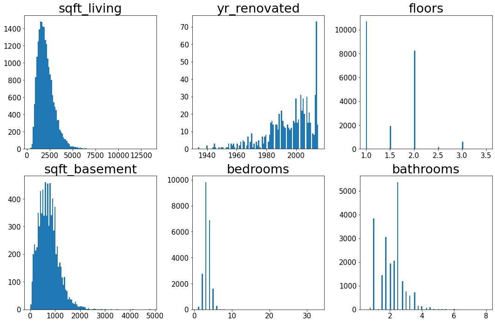
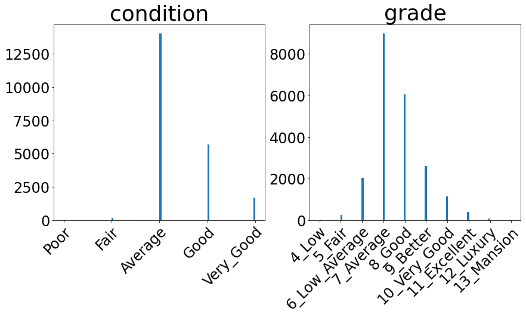

<h1 align='center'><strong><u>King County Development</u></strong></h1>
<p align="center">
    
</p>
<h3 align='center'><strong><em>An Academic Multiple Regression Analysis Project</em></strong></h3>
<h3 align='center'><strong><em>by <a href="www.linkedin.com/in/devin-sarnataro-0b639b148">Devin Sarnataro</a></em></strong></h3>
<h4 align='center'>September 15th, 2022</h4>

| <h1 align='center'><center><strong><u>Repository Structure</u></strong></center></h1> | <h1 align='center'><center><strong><u>Table of Contents</u></strong></center></h1> |
| :- | :- |
|   <ul><li>[data](#https://github.com/sarnadpy32/king_county_development/tree/master/data)</li><li>[images](#https://github.com/sarnadpy32/king_county_development/tree/master/images)</li><li>[visuals](#https://github.com/sarnadpy32/king_county_development/tree/master/visuals)</li><li>[Phase 2 - Project - yr_built changed.ipynb](#https://github.com/sarnadpy32/king_county_development/blob/master/Phase%202%20-%20Project%20-%20yr_built%20changed.ipynb)</li><li>[Phase 2 - Project.ipynb](#https://github.com/sarnadpy32/king_county_development/blob/master/Phase%202%20-%20Project.ipynb)</li><li>[Presentation.pptx](#https://github.com/sarnadpy32/king_county_development/blob/master/Presentation.pptx)</li><li>[README.md](#https://github.com/sarnadpy32/king_county_development/blob/master/README.md)</li><li>[notebook.pdf](#https://github.com/sarnadpy32/king_county_development/blob/master/notebook.pdf)</li><li>[pdf_presentation.pdf](#https://github.com/sarnadpy32/king_county_development/blob/master/pdf_presentation.pdf)</li></ul> | <ul><li>[Project Overview](#sect_proj_over)</li><li>[Stakeholder & Business Problem](#sect_bus_under)</li><li>[Understanding & Preparing the Data](#sect_data_under)</li><ul><li>[Initial Data Exploration](#sect_expl_data)</li><li>[Feature Distribution Visualizations](#sect_dist_viz)</li><li>[Preprocessed DataFrames](#sect_preproc)</li></ul><li>[Model Iterations](#sect_model_iter)</li><li>[Insights and Conclusions](#sect_insights_and_conclusions)</li><li>[Future Investigations](#sect_fut_invest)</li> |                               
<a id='sect_proj_over'></a>

<h1 align='center'><strong><u>Project Overview</u></strong></h1>

&nbsp;&nbsp;&nbsp;&nbsp;For this project, <a href='https://flatironschool.com/'>Flatiron School</a> provided me with a dataset of residential property sales in King County, Washington.
&ensp;We were instructed to create a hypothetical stakeholder, or client, as well as design a business problem that could be addressed with a multiple regression analysis.
&ensp;I created a real estate development company called King County Development.
&ensp;For the specific business problem, I chose to provide the real estate developer with key insights into which property features were the most relevant in predicting the sales price, and to what extent those features affected the sales price.

&nbsp;&nbsp;&nbsp;&nbsp;Along with the dataset, Flatiron also provided me with a `.md` <a href="https://github.com/sarnadpy32/king_county_development/blob/master/data/column_names.md">file with the column names and a brief description of each column</a>.
&ensp;I've included the columns and their descriptions below if you click on the collapsible section.

<details align='center'>
    <summary><center><strong>&mdash;&nbsp;&nbsp;&nbsp;&nbsp;Click Here to see the Column Names and Descriptions.&nbsp;&nbsp;&nbsp;&nbsp;&mdash;</strong></center></summary>

| Column | Description | Additional Information |
| :-: | :-: | :-: |
| `id` | Unique identifier for a house | |
| `date` | Date house was sold | |
| `price` | Sale price<br>(prediction target) | |
| `bedrooms` | Number of bedrooms | |
| `bathrooms` | Number of bathrooms | |
| `sqft_living` | Square footage of living space in the home | |
| `sqft_lot` | Square footage of the lot | |
| `floors` | Number of floors (levels) in house | |
| `waterfront` | Whether the house is on a waterfront | <em>(Includes Duwamish, Elliott Bay, Puget Sound, Lake Union, Ship Canal, Lake Washington, Lake Sammamish, other lake, and river/slough waterfronts)</em> |
| `view` | Quality of view from house | <em>(Includes views of Mt. Rainier, Olympics, Cascades, Territorial, Seattle Skyline, Puget Sound, Lake Washington, Lake Sammamish, small lake / river / creek, and other)</em> |
| `condition` | How good the overall condition of the house is. Related to maintenance of house. | `1 = Poor`<br>Worn out. Repair and overhaul needed on painted surfaces, roofing, plumbing, heating and numerous functional inadequacies. Excessive deferred maintenance and abuse, limited value-in-use, approaching abandonment or major reconstruction; reuse or change in occupancy is imminent. Effective age is near the end of the scale regardless of the actual chronological age.<br><br>`2 = Fair`<br>Badly worn. Much repair needed. Many items need refinishing or overhauling, deferred maintenance obvious, inadequate building utility and systems all shortening the life expectancy and increasing the effective age.<br><br>`3 = Average`<br>Some evidence of deferred maintenance and normal obsolescence with age in that a few minor repairs are needed, along with some refinishing. All major components still functional and contributing toward an extended life expectancy. Effective age and utility is standard for like properties of its class and usage.<br><br>`4 = Good`<br>No obvious maintenance required but neither is everything new. Appearance and utility are above the standard and the overall effective age will be lower than the typical property.<br><br>`5 = Very Good`<br>All items well maintained, many having been overhauled and repaired as they have shown signs of wear, increasing the life expectancy and lowering the effective age with little deterioration or obsolescence evident with a high degree of utility.|
| grade | Overall grade of the house. Related to the construction and design of the house. | `1-3`<br>Falls short of minimum building standards. Normally cabin or inferior structure.<br><br>`4`<br>Generally older, low quality construction. Does not meet code.<br><br>`5`<br>Low construction costs and workmanship. Small, simple design.<br><br>`6`<br>Lowest grade currently meeting building code. Low quality materials and simple designs.<br><br>`7`<br>Average grade of construction and design. Commonly seen in plats and older sub-divisions.<br><br>`8`<br>Just above average in construction and design. Usually better materials in both the exterior and interior finish work.<br><br>`9`<br>Better architectural design with extra interior and exterior design and quality.<br><br>`10`<br>Homes of this quality generally have high quality features. Finish work is better and more design quality is seen in the floor plans. Generally have a larger square footage.<br><br>`11`<br>Custom design and higher quality finish work with added amenities of solid woods, bathroom fixtures and more luxurious options.<br><br>`12`<br>Custom design and excellent builders. All materials are of the highest quality and all conveniences are present.<br><br>`13`<br>Generally custom designed and built. Mansion level. Large amount of highest quality cabinet work, wood trim, marble, entry ways etc. |
| `sqft_above` | Square footage of house apart from basement | |
| `sqft_basement` | Square footage of the basement | |
| `yr_built` | Year when house was built | |
| `yr_renovated` | Year when house was renovated | |
| `zipcode` | ZIP Code used by the United States Postal Service | |
| `lat` | Latitude coordinate | |
| `long` | Longitude coordinate | |
| `sqft_living15` | The square footage of interior housing living space for the nearest 15 neighbors | |
| `sqft_lot15` | The square footage of the land lots of the nearest 15 neighbors | |
    
</details>

&nbsp;&nbsp;&nbsp;&nbsp;Two of the columns, `condition` and `grade`, had categories that required me to check the King County Assessor’s <a href='https://info.kingcounty.gov/assessor/esales/Glossary.aspx?type=r'>glossary of terms</a> to see what the entities within the columns specifically meant.
&ensp;I also used the opportunity to explore the site a little, and by doing so I was able to obtain a map of the county from the county government's <a href="https://gismaps.kingcounty.gov/iMap/">iMap</a> feature.
<br><br>
<details align='center'>
    <summary><center><strong>&mdash;&nbsp;&nbsp;&nbsp;&nbsp;Click Here to see a Map of King County.&nbsp;&nbsp;&nbsp;&nbsp;&mdash;</strong></center></summary>

<p align="center">
    
</p>
    
</details>

<a id='sect_bus_under'></a>

<h1 align="center"><b><u>Stakeholder & Business Problem</u></b></h1>

&nbsp;&nbsp;&nbsp;&nbsp;As I previously mentioned, I chose a real estate developer as the stakeholder for this project.
&ensp;Flatiron had recommended a real estate agency for students having a hard time coming up with a hypothetical stakeholder, so I did have that in mind as I started the project.
While I could have chosen a real estate agency, I felt a developer could make better use of the insights I gained through my analysis.  

&nbsp;&nbsp;&nbsp;&nbsp;Real estate agencies would be limited by the desires of their client and the physical location of the client’s property.
&ensp;Developers have more freedom in their decision making, both in terms what changes to make to the properties they acquire, and what properties to acquire in the first place.
&ensp;They may ultimately rely on investors to acquire the property, but they will need an analysis like this, to convince those investors of the potential value of a property or a specific design.
&ensp;A real estate developer could also take on clients simply wanting renovations, or even remodeling services.

&nbsp;&nbsp;&nbsp;&nbsp;For a potential business problem, I chose to identify the features that had the most significant impact on, and were the most statistically relevant to, the sales price of residential properties.
&ensp;I could then develop specific recommendations based on which features were identified as being statistically significant.
&ensp;That way I could provide King County Development with recommendations that would help them to:
-	Be profitable
-	Be efficient in their spending
-	Provide the highest quality services to their clients and / or investors


<a id='sect_data_under'></a>

<h1 align="center"><u>Understanding & Preparing the Data</u></h1>

<a id='sect_expl_data'></a>

<h2 align="center">Initial Data Exploration</h2>

&nbsp;&nbsp;&nbsp;&nbsp;I began my analysis by importing the dataset provided to me by <a href='https://flatironschool.com/'>Flatiron School</a>.
&ensp;I decided to sort the dataframe by `id`, as it would make identifying any potential duplicates easier.
&ensp;During my analysis, I also found out that there were 70 different ZIP codes, so I downloaded the free ZIP code database available at <a href='https://www.unitedstateszipcodes.org/zip-code-database/'>this page</a>, to replace the ZIP codes with the appropriate city names.
&ensp;This reduced the number of categories in the column to 24 and served as a more useful tool for analysis.

&nbsp;&nbsp;&nbsp;&nbsp;After ensuring there were no duplicates, I handled entries with missing data with the appropriate encoders from `sklearn`, and dropped the columns that served no purpose in my analysis.
&ensp;I then split the data into the target (dependent variable) series and two separate dataframes for the independent variables, one for the numerical independent variables, and one for the categorical independent variables.

<a id='sect_dist_viz'></a>

<h2 align='center'><strong>Feature Distribution Visualizations</strong></h2>

&nbsp;&nbsp;&nbsp;&nbsp;I created distribution visualizations to explore each of the features.
&ensp;I used the visualizations, as well as the `describe` and `value_counts` functions, to identify and eliminate outliers, and to restructure features if necessary.
&ensp;The only visualization that I will specifically discuss in this summary is the one I created for the `City` feature, as it is crucial to understanding my analysis.
&ensp;As you can see, there were almost 9,000 residential property sales in Seattle alone, much more than any other single city.
&ensp;I therefore decided it would be highly useful to create three separate models, one for all of King County, one for inside of Seattle, and one for outside of Seattle, and then compare the results.

<br>
<p align='center'>
    
</p>
<br>
<details align='center'>
    <summary><center><strong><center>&mdash;&nbsp;&nbsp;&nbsp;&nbsp;Click Here to see the other Visualizations I created.&nbsp;&nbsp;&nbsp;&nbsp;&mdash;</center></strong></center></summary>

<h3 align='center'><strong>Price Distribution Visualization</strong></h3>
<br>
<!-- &nbsp;&nbsp;&nbsp;&nbsp;I first checked the distribution of `price` (the target variable).
&ensp;Before I created any visualizations, I wrote functions to properly format the ticks of any visualizations and any `pandas` outputs that contained currency information, as well a function to get a lighter version of a simple, prenamed color to use in visualizations as needed. -->
<!-- <br> -->
<details align='center'>
    <summary><center><strong><center>&mdash;&nbsp;&nbsp;&nbsp;&nbsp;Click Here to see the Visualization.&nbsp;&nbsp;&nbsp;&nbsp;&mdash;</center></strong></center></summary>
    <p align='center'>
        
    </p>
</details>    
<br>
<details align='center'>
    <summary><center><strong>&mdash;&nbsp;&nbsp;&nbsp;&nbsp;Click Here to see the Visualization.&nbsp;&nbsp;&nbsp;&nbsp;&mdash;</strong></center></summary>
    <p align='center'>
        
    </p>
</details>
<br>
<h3 align='center'><strong>Numerical Features Distribution Visualizations</strong></h3>
<br>
<!-- &nbsp;&nbsp;&nbsp;&nbsp;I then created visualizations to explore the distributions of the numerical features. -->
<!-- <br> -->
<details align='center'>
    <summary><center><strong>&mdash;&nbsp;&nbsp;&nbsp;&nbsp;Click Here to see the Visualizations.&nbsp;&nbsp;&nbsp;&nbsp;&mdash;</strong></center></summary>
    <p align='center'>
        
    </p>
</details>
<br>
<a id='sub_sect_cat_feat_dist_viz'></a>
<h3 align='center'><strong>Categorical Features Distribution Visualizations</strong></h3>
<!-- 
&nbsp;&nbsp;&nbsp;&nbsp;After the numerical features were taken care of, I checked the distribution of the categorical variables.
&ensp;These would have to be encoded in an appropriate manner to be used in my model. -->
<br>
<details align='center'>
    <summary><center><strong>&mdash;&nbsp;&nbsp;&nbsp;&nbsp;Click Here to see the Visualizations.&nbsp;&nbsp;&nbsp;&nbsp;&mdash;</strong></center></summary>
    <p align='center'>
        
    </p>
</details>
<br>
<details align='center'>
    <summary><center><strong>&mdash;&nbsp;&nbsp;&nbsp;&nbsp;Click Here to see the Visualizations.&nbsp;&nbsp;&nbsp;&nbsp;&mdash;</strong></center></summary>
    <p align='center'>
        
    </p>
</details>
    
</details>

<a id='sect_preproc'></a>

<h2 align='center'><strong>Preprocessed DataFrames</strong></h2>

&nbsp;&nbsp;&nbsp;&nbsp;After removing the `sqft_above` column because it was highly correlated with the `sqft_living` column, the numerical features were ready, so I turned my attention to the categorical features.
&ensp;I used the `OneHotEncoder()` on the appropriate columns to create a properly encoded version of `kc_cats`.
&ensp;I then recombined the numerical and categorical features into a full preprocessed dataframe for all of King County, which I split into preprocessed dataframes for inside of Seattle and outside of Seattle.
&ensp;Then I split all three preprocessed dataframes into their `X` and `y` components, which you can view by clicking on the collapsible sections below.

<details align='center'>
    <summary><center><strong>&mdash;&nbsp;&nbsp;&nbsp;&nbsp;Click Here to see the <code>.info()</code> of the X and Y components of the Preprocessed DataFrame for each of the Three Models.&nbsp;&nbsp;&nbsp;&nbsp;&mdash;</strong></center></summary>

<h3 align='center'><strong>All King County Preprocessed DataFrame</strong></h3>
<br>
<details align='center'>
    <summary><center><strong>&mdash;&nbsp;&nbsp;&nbsp;&nbsp;Click Here to see the <code>.info()</code> of the X and Y components of the All King County Preprocessed DataFrame.&nbsp;&nbsp;&nbsp;&nbsp;&mdash;</strong></center></summary>

        kc_X:
    
        Index: 21252 entries, 2495 to 15937
        Data columns (total 32 columns):
         #------ Column                   Non-Null Count  Dtype  
        ---  ------                   --------------  -----  
         0   sqft_living              21252 non-null  int64  
         1   sqft_lot                 21252 non-null  int64  
         2   sqft_living15            21252 non-null  int64  
         3   sqft_lot15               21252 non-null  int64  
         4   floors                   21252 non-null  float64
         5   bedrooms                 21252 non-null  int64  
         6   bathrooms                21252 non-null  float64
         7   basement                 21252 non-null  int32  
         8   grade_4_Low              21252 non-null  float64
         9   grade_5_Fair             21252 non-null  float64
         10  grade_6_Low_Average      21252 non-null  float64
         11  grade_7_Average          21252 non-null  float64
         12  grade_8_Good             21252 non-null  float64
         13  grade_9_Better           21252 non-null  float64
         14  grade_10_Very_Good       21252 non-null  float64
         15  grade_11_Excellent       21252 non-null  float64
         16  grade_12_Luxury          21252 non-null  float64
         17  view_FAIR                21252 non-null  float64
         18  view_AVERAGE             21252 non-null  float64
         19  view_GOOD                21252 non-null  float64
         20  view_EXCELLENT           21252 non-null  float64
         21  waterfront               21252 non-null  int64  
         22  condition_Fair           21252 non-null  float64
         23  condition_Average        21252 non-null  float64
         24  condition_Good           21252 non-null  float64
         25  condition_Very_Good      21252 non-null  float64
         26  renovated                21252 non-null  int32  
         27  yr_built_1920_to_1940_s  21252 non-null  float64
         28  yr_built_1940_to_1960_s  21252 non-null  float64
         29  yr_built_1960_to_1980_s  21252 non-null  float64
         30  yr_built_1980_to_2000_s  21252 non-null  float64
         31  yr_built_2000_to_2020_s  21252 non-null  float64
        dtypes: float64(24), int32(2), int64(6)
        memory usage: 5.7+ MB
    
        kc_y:
    
        Index: 21252 entries, 2495 to 15937
        Series name: price
        Non-Null Count  Dtype  
        --------------  -----  
        21252 non-null  float64
        dtypes: float64(1)
        memory usage: 848.1+ KB
    
</details>


<h3 align='center'><strong>Seattle Preprocessed DataFrame</strong></h3>
<br>
<details align='center'>
    <summary><center><strong>&mdash;&nbsp;&nbsp;&nbsp;&nbsp;Click Here to see the <code>.info()</code> of the X and Y components of the Seattle Preprocessed DataFrame.&nbsp;&nbsp;&nbsp;&nbsp;&mdash;</strong></center></summary>

    kc_X_seattle:
    
    Index: 8828 entries, 6729 to 15937
    Data columns (total 23 columns):
     #------ Column                   Non-Null Count  Dtype  
    ---  ------                   --------------  -----  
     0   sqft_living              8828 non-null   int64  
     1   sqft_lot                 8828 non-null   int64  
     2   sqft_living15            8828 non-null   int64  
     3   sqft_lot15               8828 non-null   int64  
     4   floors                   8828 non-null   float64
     5   bedrooms                 8828 non-null   int64  
     6   bathrooms                8828 non-null   float64
     7   grade_5_Fair             8828 non-null   float64
     8   grade_6_Low_Average      8828 non-null   float64
     9   grade_8_Good             8828 non-null   float64
     10  grade_9_Better           8828 non-null   float64
     11  grade_10_Very_Good       8828 non-null   float64
     12  grade_11_Excellent       8828 non-null   float64
     13  grade_12_Luxury          8828 non-null   float64
     14  view_GOOD                8828 non-null   float64
     15  view_EXCELLENT           8828 non-null   float64
     16  waterfront               8828 non-null   int64  
     17  condition_Good           8828 non-null   float64
     18  condition_Very_Good      8828 non-null   float64
     19  yr_built_1940_to_1960_s  8828 non-null   float64
     20  yr_built_1960_to_1980_s  8828 non-null   float64
     21  yr_built_1980_to_2000_s  8828 non-null   float64
     22  yr_built_2000_to_2020_s  8828 non-null   float64
    dtypes: float64(17), int64(6)
    memory usage: 1.9+ MB
    
    kc_y_seattle:
    
    Index: 8828 entries, 6729 to 15937
    Series name: price
    Non-Null Count  Dtype  
    --------------  -----  
    8828 non-null   float64
    dtypes: float64(1)
    memory usage: 396.0+ KB
    
</details>

<h3 align='center'><strong>Outside Seattle Preprocessed DataFrame</strong></h3>
<br>
<details align='center'>
    <summary><center><strong>&mdash;&nbsp;&nbsp;&nbsp;&nbsp;Click Here to see the <code>.info()</code> of the X and Y components of the Outside Seattle Preprocessed DataFrame.&nbsp;&nbsp;&nbsp;&nbsp;&mdash;</strong></center></summary>
    
    kc_X_out_seattle:
    
    Index: 12424 entries, 2495 to 20963
    Data columns (total 26 columns):
     #------ Column                   Non-Null Count  Dtype  
    ---  ------                   --------------  -----  
     0   sqft_lot                 12424 non-null  int64  
     1   sqft_living15            12424 non-null  int64  
     2   sqft_lot15               12424 non-null  int64  
     3   floors                   12424 non-null  float64
     4   bedrooms                 12424 non-null  int64  
     5   bathrooms                12424 non-null  float64
     6   basement                 12424 non-null  int32  
     7   grade_5_Fair             12424 non-null  float64
     8   grade_6_Low_Average      12424 non-null  float64
     9   grade_8_Good             12424 non-null  float64
     10  grade_9_Better           12424 non-null  float64
     11  grade_10_Very_Good       12424 non-null  float64
     12  grade_11_Excellent       12424 non-null  float64
     13  grade_12_Luxury          12424 non-null  float64
     14  view_FAIR                12424 non-null  float64
     15  view_AVERAGE             12424 non-null  float64
     16  view_GOOD                12424 non-null  float64
     17  view_EXCELLENT           12424 non-null  float64
     18  waterfront               12424 non-null  int64  
     19  condition_Good           12424 non-null  float64
     20  condition_Very_Good      12424 non-null  float64
     21  renovated                12424 non-null  int32  
     22  yr_built_1920_to_1940_s  12424 non-null  float64
     23  yr_built_1940_to_1960_s  12424 non-null  float64
     24  yr_built_1960_to_1980_s  12424 non-null  float64
     25  yr_built_2000_to_2020_s  12424 non-null  float64
    dtypes: float64(19), int32(2), int64(5)
    memory usage: 2.7+ MB
    None
    
    kc_y_out_seattle:
    
    Index: 12424 entries, 2495 to 20963
    Series name: price
    Non-Null Count  Dtype  
    --------------  -----  
    12424 non-null  float64
    dtypes: float64(1)
    memory usage: 452.2+ KB
    None
    
</details>
    
</details>

<a id='sect_model_iter'></a>

<h1 align='center'><strong><u>Model Iterations</u></strong></h1>

&nbsp;&nbsp;&nbsp;&nbsp;With the preprocessed dataframes ready, I could begin building models.
&ensp;The base models for each preprocessed dataframe were simply the relationship between the target variable, `price`, and the most correlated feature, `sqft_living`, which could then be used to judge the performance of any future model iterations.
&ensp;After establishing a baseline for each preprocessed dataframe, I created models for each with all the predictors available.
&ensp;I then began eliminating them to create a final model with only the best predictors.
&ensp;I eliminated the predictors using three methods:
- `Variance Inflation Factor (VIF)`
    - Predictors with high levels of multicollinearity missed by my initial correlation examination were eliminated.
- `Recursive Feature Elimination with Cross-Validation (RFECV)`
    - Using machine learning to eliminate the weakest features.
- `P-Values`
    - Any remaining features with `p-values` less than the standard confidence level of `0.05` were eliminated to only include the predictors of the highest statistical significance.

&nbsp;&nbsp;&nbsp;&nbsp;Once the predictors for each model were finalized, I could investigate the `Linearity, Normality, and Homoscedasticity` of the predicted values generated by each model.
&ensp;For each of the models, a log transformation of the target variable was necessary for the model to meet the assumptions required when building multiple linear regression models.
&ensp;I then had a final equation that I could analyze to produce my [Insights and Conclusions](#sect_insights_and_conclusions).
&ensp;I transformed the coefficients in the equation to make understanding them easier.
&ensp;I also created simple dataframes with the coefficients, the $r^2$, and the adjusted $r^2$ scores from each model to make any comparisons between the models easier.
&ensp;If you click on the collapsible section below, you can see more details on the model iterations I created, as well as the model comparison dataframes and the final equations for each model.
&ensp;It is 

<a id='sub_sect_kc'></a>

<details align='center'>
    <summary><center><strong>&mdash;&nbsp;&nbsp;&nbsp;&nbsp;Click Here to see the details on the model iterations, the model comparison dataframes, and the final equations for the three models.&nbsp;&nbsp;&nbsp;&nbsp;&mdash;</strong></center></summary>
<h2 align='center'><strong>All King County Models</strong></h2>

<h3 align='center'><strong>Comparing <code>kc</code> Models</strong></h3>
<br>
<details align='center'>
    <summary><center><strong>&mdash;&nbsp;&nbsp;&nbsp;&nbsp;Click Here to see the <code>kc</code> Model Comparison DataFrame.&nbsp;&nbsp;&nbsp;&nbsp;&mdash;</strong></center></summary>

|                         |   base   |     full     |  full_VIF  |  full_RFECV  |    fin     |   log   |
|:-----------------------:|:--------:|:------------:|:----------:|:------------:|:----------:|:-------:|
|          const          | -7280.35 | 1.85126e+06  | 181853.63  |  184086.86   | 184086.86  | 12.4751 |
|       sqft_living       |  261.48  |    101.41    |     -      |      -       |     -      |    -    |
|        sqft_lot         |    -     |      0       |    0.16    |     0.16     |    0.16    |   0.0   |
|      sqft_living15      |    -     |    43.95     |   84.43    |     85.0     |    85.0    | 0.0002  |
|       sqft_lot15        |    -     |    -0.41     |   -0.34    |    -0.34     |   -0.34    |  -0.0   |
|         floors          |    -     |   32242.4    |  38391.34  |   38596.57   |  38596.57  | 0.0798  |
|        bedrooms         |    -     |    -20564    |  1876.15   |      -       |     -      |    -    |
|        bathrooms        |    -     |   43649.6    |  77424.92  |   78637.52   |  78637.52  | 0.1102  |
|        basement         |    -     |   28271.1    |  46838.03  |   46921.4    |  46921.4   | 0.1023  |
|       grade_4_Low       |    -     | -1.84586e+06 | -202612.19 |  -205199.69  | -205199.69 | -0.733  |
|      grade_5_Fair       |    -     | -1.80682e+06 | -156429.53 |  -158160.98  | -158160.98 | -0.4922 |
|   grade_6_Low_Average   |    -     | -1.75162e+06 | -91864.21  |  -92576.01   | -92576.01  | -0.2792 |
|     grade_7_Average     |    -     | -1.66648e+06 |     -      |      -       |     -      |    -    |
|      grade_8_Good       |    -     | -1.58169e+06 |  96157.1   |   96053.56   |  96053.56  | 0.2232  |
|     grade_9_Better      |    -     | -1.4403e+06  | 267735.68  |  267709.22   | 267709.22  | 0.4668  |
|   grade_10_Very_Good    |    -     | -1.24836e+06 |  491630.8  |  491261.71   | 491261.71  | 0.6668  |
|   grade_11_Excellent    |    -     |   -979480    | 796781.64  |  796239.55   | 796239.55  | 0.8407  |
|     grade_12_Luxury     |    -     |   -732027    | 1073845.32 |  1072828.69  | 1072828.69 | 0.9651  |
|        view_FAIR        |    -     |    108804    | 112440.75  |  112164.38   | 112164.38  | 0.1442  |
|      view_AVERAGE       |    -     |   52721.4    |  57588.41  |   57406.37   |  57406.37  | 0.0781  |
|        view_GOOD        |    -     |    109098    | 112817.17  |  112393.29   | 112393.29  | 0.0971  |
|     view_EXCELLENT      |    -     |    277423    | 283667.93  |  283371.66   | 283371.66  | 0.2578  |
|       waterfront        |    -     |    391638    | 403652.08  |   402814.2   |  402814.2  | 0.3097  |
|     condition_Fair      |    -     |   18184.8    | -26034.46  |      -       |     -      |    -    |
|    condition_Average    |    -     |   41651.8    |     -      |      -       |     -      |    -    |
|     condition_Good      |    -     |   70256.4    |  31452.89  |   32015.22   |  32015.22  | 0.0517  |
|   condition_Very_Good   |    -     |    109976    |  71782.15  |   72384.31   |  72384.31  | 0.1136  |
|        renovated        |    -     |   43209.9    |  50488.77  |   50507.01   |  50507.01  | 0.0428  |
| yr_built_1920_to_1940_s |    -     |   -21387.5   | -22770.59  |  -22905.56   | -22905.56  | -0.0518 |
| yr_built_1940_to_1960_s |    -     |   -90311.3   | -91173.55  |  -91062.34   | -91062.34  | -0.1928 |
| yr_built_1960_to_1980_s |    -     |   -189001    | -197283.5  |  -196955.07  | -196955.07 | -0.3973 |
| yr_built_1980_to_2000_s |    -     |   -267220    | -281701.49 |  -282060.51  | -282060.51 | -0.4949 |
| yr_built_2000_to_2020_s |    -     |   -244944    | -256734.33 |  -257185.94  | -257185.94 | -0.456  |
|         r_score         |   0.46   |     0.67     |    0.65    |     0.65     |    0.65    | 0.6452  |
|       r_adj_score       |   0.46   |     0.67     |    0.65    |     0.65     |    0.65    | 0.6448  |
    
</details>

<h3 align='center'><strong><code>kc_log_eq</code></strong></h3>
<br>
<details align='center'>
    <summary><center><strong>&mdash;&nbsp;&nbsp;&nbsp;&nbsp;Click Here to see the Final Equation for the <code>kc</code> Model.&nbsp;&nbsp;&nbsp;&nbsp;&mdash;</strong></center></summary>

```
price = 261735 +
0% * sqft_lot +
0% * sqft_living15 +
0% * sqft_lot15 +
7% * floors +
11% * bathrooms +
10% * basement +
-73% * grade_4_Low +
-49% * grade_5_Fair +
-27% * grade_6_Low_Average +
22% * grade_8_Good +
46% * grade_9_Better +
66% * grade_10_Very_Good +
84% * grade_11_Excellent +
96% * grade_12_Luxury +
14% * view_FAIR +
7% * view_AVERAGE +
9% * view_GOOD +
25% * view_EXCELLENT +
30% * waterfront +
5% * condition_Good +
11% * condition_Very_Good +
4% * renovated +
-5% * yr_built_1920_to_1940_s +
-19% * yr_built_1940_to_1960_s +
-39% * yr_built_1960_to_1980_s +
-49% * yr_built_1980_to_2000_s +
-45% * yr_built_2000_to_2020_s
```
    
</details>

<h2 align='center'><strong>Seattle Models</strong></h2>


<h3 align='center'><strong>Comparing <code>seattle</code> Models</strong></h3>
<br>
<details align='center'>
    <summary><center><strong>&mdash;&nbsp;&nbsp;&nbsp;&nbsp;Click Here to see the <code>seattle</code> Model Comparison DataFrame.&nbsp;&nbsp;&nbsp;&nbsp;&mdash;</strong></center></summary>

|                         |  base   |   full   |  full_VIF  |  full_RFECV  |    fin     | log     |
|:-----------------------:|:-------:|:--------:|:----------:|:------------:|:----------:|:--------|
|          const          | 7148.41 |  491438  | 158847.89  |  155356.89   | 150633.28  | 12.5694 |
|       sqft_living       | 293.17  |  135.15  |   136.21   |    136.39    |   134.33   | 0.0002  |
|        sqft_lot         |    -    |  -2.51   |   -2.51    |    -2.54     |   -2.48    | -0.0    |
|      sqft_living15      |    -    |  131.77  |   131.11   |    131.46    |   131.75   | 0.0002  |
|       sqft_lot15        |    -    |  -10.48  |   -10.53   |    -10.54    |   -10.41   | -0.0    |
|         floors          |    -    |  26516   |  26529.99  |   26635.76   |  29577.71  | 0.0254  |
|        bedrooms         |    -    | -20287.8 | -20608.57  |  -20596.79   | -20490.59  | -0.0288 |
|        bathrooms        |    -    | 22132.3  |  22340.04  |   22311.97   |  21428.51  | 0.0455  |
|        basement         |    -    | -6765.95 |  -7093.05  |   -7230.78   |     -      | -       |
|      grade_5_Fair       |    -    | -553126  | -85545.22  |  -87652.26   | -85594.76  | -0.412  |
|   grade_6_Low_Average   |    -    | -536149  | -62415.59  |  -62528.72   | -61946.55  | -0.2459 |
|     grade_7_Average     |    -    | -474583  |     -      |      -       |     -      | -       |
|      grade_8_Good       |    -    | -393684  |  80506.23  |   80651.86   |  80722.49  | 0.1949  |
|     grade_9_Better      |    -    | -190466  | 283354.67  |  283346.02   | 284470.63  | 0.4383  |
|   grade_10_Very_Good    |    -    | 63240.3  | 536847.91  |  536678.08   | 538149.36  | 0.5654  |
|   grade_11_Excellent    |    -    |  451839  | 925217.63  |  925367.66   | 927254.11  | 0.706   |
|     grade_12_Luxury     |    -    |  786496  | 1261792.74 |  1262217.0   | 1261689.34 | 1.1849  |
|        view_FAIR        |    -    | 13241.9  |  14928.8   |   14573.3    |     -      | -       |
|      view_AVERAGE       |    -    | 2284.04  |  2245.71   |      -       |     -      | -       |
|        view_GOOD        |    -    |  40583   |  40385.02  |   39867.15   |  38758.08  | 0.0447  |
|     view_EXCELLENT      |    -    |  151865  | 150499.34  |  150208.06   | 148506.59  | 0.2145  |
|       waterfront        |    -    |  288777  |  287809.1  |  287742.45   |  287184.8  | 0.381   |
|     condition_Fair      |    -    |  123737  | -17472.86  |      -       |     -      | -       |
|    condition_Average    |    -    |  142631  |     -      |      -       |     -      | -       |
|     condition_Good      |    -    |  164662  |  22273.24  |   22633.66   |  22578.01  | 0.0705  |
|   condition_Very_Good   |    -    |  197202  |  54683.97  |   55144.57   |  54934.0   | 0.1024  |
|        renovated        |    -    | -1184.31 |  -374.69   |      -       |     -      | -       |
| yr_built_1920_to_1940_s |    -    | -5859.97 |  -4599.04  |      -       |     -      | -       |
| yr_built_1940_to_1960_s |    -    | -70917.6 | -69411.88  |  -66702.13   | -66135.54  | -0.1483 |
| yr_built_1960_to_1980_s |    -    | -170904  | -169779.18 |  -166989.49  | -166736.97 | -0.3214 |
| yr_built_1980_to_2000_s |    -    | -197924  | -197007.95 |  -194238.87  | -193683.66 | -0.3039 |
| yr_built_2000_to_2020_s |    -    | -202398  | -201521.89 |  -198890.26  | -200151.41 | -0.3417 |
|         r_score         |  0.49   |   0.75   |    0.75    |     0.75     |    0.75    | 0.6978  |
|       r_adj_score       |  0.49   |   0.75   |    0.75    |     0.75     |    0.75    | 0.697   |
    
</details>

<h3 align='center'><strong><code>seattle_log_eq</code></strong></h3>
<br>
<details align='center'>
    <summary><center><strong>&mdash;&nbsp;&nbsp;&nbsp;&nbsp;Click Here to see the Final Equation for the <code>seattle</code> Model.&nbsp;&nbsp;&nbsp;&nbsp;&mdash;</strong></center></summary>

```
price = 287626 +
0% * sqft_living +
0% * sqft_lot +
0% * sqft_living15 +
0% * sqft_lot15 +
2% * floors +
-2% * bedrooms +
4% * bathrooms +
-41% * grade_5_Fair +
-24% * grade_6_Low_Average +
19% * grade_8_Good +
43% * grade_9_Better +
56% * grade_10_Very_Good +
70% * grade_11_Excellent +
118% * grade_12_Luxury +
4% * view_GOOD +
21% * view_EXCELLENT +
38% * waterfront +
7% * condition_Good +
10% * condition_Very_Good +
-14% * yr_built_1940_to_1960_s +
-32% * yr_built_1960_to_1980_s +
-30% * yr_built_1980_to_2000_s +
-34% * yr_built_2000_to_2020_s
```
    
</details>
      
<a id='sub_sect_out_seattle'></a>

<h2 align='center'><strong>Outside Seattle Models</strong></h2>

<h3 align='center'><strong>Comparing <code>out_seattle</code> Models</strong></h3>
<br>
<details align='center'>
    <summary><center><strong>&mdash;&nbsp;&nbsp;&nbsp;&nbsp;Click Here to see the <code>out_seattle</code> Model Comparison DataFrame.&nbsp;&nbsp;&nbsp;&nbsp;&mdash;</strong></center></summary>

|                         |   base    |     full     |  full_VIF  |  full_RFECV  |    fin     | log     |
|:-----------------------:|:---------:|:------------:|:----------:|:------------:|:----------:|:--------|
|          const          | -88031.96 | 1.62385e+06  | -71551.43  |  -71551.43   | -72877.59  | 11.9124 |
|       sqft_living       |  274.79   |    117.21    |     -      |      -       |     -      | -       |
|        sqft_lot         |     -     |     0.09     |    0.28    |     0.28     |    0.27    | 0.0     |
|      sqft_living15      |     -     |    59.57     |   100.06   |    100.06    |   100.09   | 0.0002  |
|       sqft_lot15        |     -     |    -0.29     |   -0.22    |    -0.22     |   -0.22    | -0.0    |
|         floors          |     -     |   -33303.7   | -17430.15  |  -17430.15   | -17429.06  | 0.0063  |
|        bedrooms         |     -     |   -17308.3   |  7787.86   |   7787.86    |  7859.85   | 0.0154  |
|        bathrooms        |     -     |   50836.9    |  88325.45  |   88325.45   |  88620.09  | 0.1255  |
|        basement         |     -     |   -12974.7   |  15322.16  |   15322.16   |  15217.88  | 0.0435  |
|       grade_4_Low       |     -     | -1.54636e+06 | -68083.09  |  -68083.09   |     -      | -       |
|      grade_5_Fair       |     -     | -1.54258e+06 | -70039.11  |  -70039.11   | -69234.79  | -0.2987 |
|   grade_6_Low_Average   |     -     | -1.5127e+06  | -44490.69  |  -44490.69   | -44259.22  | -0.1998 |
|     grade_7_Average     |     -     | -1.46058e+06 |     -      |      -       |     -      | -       |
|      grade_8_Good       |     -     | -1.39666e+06 |  79979.87  |   79979.87   |  80128.48  | 0.2084  |
|     grade_9_Better      |     -     | -1.29099e+06 |  218543.6  |   218543.6   | 218659.91  | 0.4119  |
|   grade_10_Very_Good    |     -     | -1.12667e+06 | 421548.82  |  421548.82   | 421580.38  | 0.6038  |
|   grade_11_Excellent    |     -     |   -895491    | 694388.83  |  694388.83   | 694329.46  | 0.7448  |
|     grade_12_Luxury     |     -     |   -620164    | 1008847.43 |  1008847.43  | 1008671.92 | 0.8752  |
|        view_FAIR        |     -     |    188561    | 195214.73  |  195214.73   | 194746.14  | 0.2116  |
|      view_AVERAGE       |     -     |   58891.4    |  69604.22  |   69604.22   |  69726.34  | 0.0795  |
|        view_GOOD        |     -     |   85552.9    |  88884.54  |   88884.54   |  88931.12  | 0.0668  |
|     view_EXCELLENT      |     -     |    351262    | 367216.01  |  367216.01   | 367194.68  | 0.2614  |
|       waterfront        |     -     |    584100    | 597325.25  |  597325.25   | 597656.29  | 0.4678  |
|     condition_Fair      |     -     |   -119906    | -29974.66  |  -29974.66   |     -      | -       |
|    condition_Average    |     -     |   -92324.2   |     -      |      -       |     -      | -       |
|     condition_Good      |     -     |   -62367.9   |  35968.72  |   35968.72   |  36503.41  | 0.0491  |
|   condition_Very_Good   |     -     |   -26097.7   |  77089.86  |   77089.86   |  77828.57  | 0.1325  |
|        renovated        |     -     |    139379    | 160733.11  |  160733.11   |  161218.9  | 0.1626  |
| yr_built_1920_to_1940_s |     -     |    341.04    |  71212.78  |   71212.78   |  69159.6   | 0.1454  |
| yr_built_1940_to_1960_s |     -     |   74516.7    | 158097.61  |  158097.61   | 157501.35  | 0.2579  |
| yr_built_1960_to_1980_s |     -     |   -20379.1   |  60449.98  |   60449.98   |  60335.75  | 0.0878  |
| yr_built_1980_to_2000_s |     -     |   -78898.1   |     -      |      -       |     -      | -       |
| yr_built_2000_to_2020_s |     -     |   -67913.1   |  23061.71  |   23061.71   |  23224.04  | 0.0279  |
|         r_score         |    0.5    |     0.67     |    0.65    |     0.65     |    0.65    | 0.6557  |
|       r_adj_score       |    0.5    |     0.67     |    0.65    |     0.65     |    0.65    | 0.655   |
    
</details>

<h3 align='center'><strong><code>out_seattle_log_eq</code></strong></h3>
<br>
<details align='center'>
    <summary><center><strong>&mdash;&nbsp;&nbsp;&nbsp;&nbsp;Click Here to see the Final Equation for the <code>out_seattle</code> Model.&nbsp;&nbsp;&nbsp;&nbsp;&mdash;</strong></center></summary>

```
price = 149110 +
0% * sqft_lot +
0% * sqft_living15 +
0% * sqft_lot15 +
0% * floors +
1% * bedrooms +
12% * bathrooms +
4% * basement +
-29% * grade_5_Fair +
-19% * grade_6_Low_Average +
20% * grade_8_Good +
41% * grade_9_Better +
60% * grade_10_Very_Good +
74% * grade_11_Excellent +
87% * grade_12_Luxury +
21% * view_FAIR +
7% * view_AVERAGE +
6% * view_GOOD +
26% * view_EXCELLENT +
46% * waterfront +
4% * condition_Good +
13% * condition_Very_Good +
16% * renovated +
14% * yr_built_1920_to_1940_s +
25% * yr_built_1940_to_1960_s +
8% * yr_built_1960_to_1980_s +
2% * yr_built_2000_to_2020_s
```
    
</details>
    
</details>

&nbsp;&nbsp;&nbsp;&nbsp;Unfortunately, none of the models I created could truly be relied upon to predict the sales prices of a residential property.
&ensp;The $𝑟^2$, and the adjusted $𝑟^2$ scores never even broke a value of .7, meaning that the models were not reliable as predictive algorithms.
&ensp;I could have refined the models further to increase their predictive abilities, but I will discuss why I didn’t in the [Future Investigations](#sect_fut_invest) section.
&ensp;While the [Insights and Conclusions](#sect_insights_and_conclusions) I gleaned from my analysis are certainly an important first step, more data will need to be gathered if King County Development is to build a regression model that serves as a reliable predictive algorithm.

<a id='sect_insights_and_conclusions'></a>

<h1 align='center'><strong><u>Insights and Conclusions</u></strong></h1>

&nbsp;&nbsp;&nbsp;&nbsp;By creating the separate models, I was able to gain valuable insights.
&ensp;I created a dataframe and visualiztions with the coefficients of the three log-transformed models to identify the differences between the predictors that were included in each model and their values more easily.
&ensp;Based on my results, I developed specific recommendations for King County Development.

&nbsp;&nbsp;&nbsp;&nbsp;The most important feature in all three models was the `grade` of a property.
&ensp;King County Development should therefore develop a database of pictures of properties with each `grade` category.
&ensp;This should also be done for each of the `condition` and `view` categories, as they also had a significant impact on the sales price of a property.
&ensp;These databases could guide King County Development as they design and build new properties, or to properly advise clients seeking renovation or remodeling services as to the cost versus the reward in making changes to a property.
&ensp;They could also serve in any promotional material advertising those services.

&nbsp;&nbsp;&nbsp;&nbsp;Besides the picture databases for the `grade`, `condition`, and `view` features, my only other specific recommendations concern [Future Investigations](#sect_fut_invest), but there were other important, or at least interesting, features in my results of which King County Development should be aware.

&nbsp;&nbsp;&nbsp;&nbsp;While the square footage features were not important on a per unit basis, `Living Area` does seem to a be extremely important inside of Seattle, as it was the only model in which the `Square Footage – Living Area` feature was even included.
&ensp;It is also exhibited by the negative effect caused by increasing the number of bedrooms, holding everything else constant, in the Seattle model.
&ensp;By itself, this would actually decrease the `Living Area`, again showing its value in Seattle.
&ensp;This makes sense in an area where apartments are going to be more common than houses, which also would explain why, on the other hand, the `Basement` feature was not included inside of Seattle.

&nbsp;&nbsp;&nbsp;&nbsp;It was also very interesting that the `Renovated` feature was not included at all in the Seattle model but was very important in the Outside Seattle model.
&ensp;It was impossible to say for sure whether this was because renovations were expected in Seattle properties, or because it was not important, and people are happy just to get an apartment.
&ensp;Either way, it is absolutely something that King County Development should address in an any [Future Investigations](#sect_fut_invest).

&nbsp;&nbsp;&nbsp;&nbsp;Of course, being a `Waterfront` property adds significant value to a property, with the effect being the greatest in the Outside Seattle model.

&nbsp;&nbsp;&nbsp;&nbsp;Finally, my adjustment of the `yr_built` feature from a numerical feature to a categorical one split into periods of 20 years did not lead to any revelations worth mentioning, but I did notice a general negative trend in all three models.
&ensp;I therefore created ***insert_link_here***another version*** of my analysis in which I did not make such an adjustment to investigate this further, which confirmed my hypothesis.
&ensp;If the `yr_built` feature increased, in had a negative effect in all three models.
&ensp;This could possibly indicate that older properties are preferred to newer properties.
&ensp;This could also be addressed in any [Future Investigations](#sect_fut_invest), although I would say it should not be as high a priority as the investigating the `Renovated` feature.
&ensp;If you wish to view my analysis of each individual feature, you can click on the collapsible section below.

<details align='center'>
    <summary><center><strong>&mdash;&nbsp;&nbsp;&nbsp;&nbsp;Click Here to see my full analysis of the results.&nbsp;&nbsp;&nbsp;&nbsp;&mdash;</strong></center></summary>

<ul style='list-style-type: none;'>
    <li>Intercepts</li>
        <ul>
            <li>The Seattle model had the highest intercept, the entire King County model had the second highest, and the Outside Seattle model had the lowest.</li>
            <li>Seattle Model - &dollar;287,626.85</li>
            <li>Entire King County Model - &dollar;261,735.06</li>
            <li>Outside Seattle Model - &dollar;149,110.47</li>
        </ul>
    <li><code>sqft</code> Columns</li>
        <ul>
            <li>These columns were not important on a per unit basis, but I could still judge them by whether they were included, whether they were positive or negative, and if they were $= 0.02$ in the dataframe / visualizations, or $\approx 0$.</li>
            <li><code>sqft_living</code></li>
                <ul>
                    <li>It was only even included for the prices of residential property inside Seattle, and the fact that it was $0.02$ and positive, showing that living space is very important inside Seattle.</li>
                </ul>
            <li><code>sqft_living15</code></li>
                <ul>
                    <li>It was positive $0.02$, or very important, in all three models.</li>
                </ul>
            <li><code>sqft_lot</code></li>
                <ul>
                    <li>It was positive $\approx 0$ in the entire King County and the Outside Seattle models, and negative $\approx 0$ in the Seattle model, meaning that it was beneficial to the former, and detrimental to the latter, but not as important or harmful as if it was $0.02$.</li>
                </ul>
            <li><code>sqft_lot15</code></li>
                <ul>
                    <li>It was negative $\approx 0$, or detrimental, in all three models.</li>
                </ul>
        </ul>
    <li><code>floors</code></li>
        <ul>
            <li>This was interesting.  It was most important in the entire King County model.  In the Seattle model, it was still important, but in the Outside Seattle model, it was barely important at all.</li>
        </ul>
    <li><code>bedrooms</code></li>
        <ul>
            <li>Another interesting predictor.  It wasn’t even included in the entire King County model, and it actually had a negative effect in the Seattle model.  However, it did have a positive effect in the Outside Seattle model.</li>
        </ul>
    <li><code>bathrooms</code></li>
        <ul>
            <li>It was very important in the entire King County model, and even more so in the Outside Seattle model.  In the Seattle model it was important, especially compared to the previous predictors, but not nearly as much as in the other models.</li>
        </ul>
    <li><code>basement</code></li>
        <ul>
            <li>It wasn’t even included in the Seattle model.  It was very important in the entire King County model. In the Outside Seattle model, it was important, and its worth noting that having a basement adds more value than additional floors outside of Seattle.
        </ul>
    <li><code>grade</code></li> 
        <ul>
            <li>This seems to be the most important feature when determining the price of a property.  The categories in this feature resulted in the largest changes in price, both positively and negatively.   Anything below <code>7_Average</code> had a negative effect if it was included at all, and the lower the <code>grade</code>, the worse the effect.  <code>7_Average</code> itself was not included in any of the models.  Anything above <code>7_Average</code> had a positive effect, and the size of the effect increases as <code>grade</code> does.</li>
            <li><u>Specific Recommendation</u></li>
                <ul>
                    <li>Create a database of example pictures of properties with each <code>grade</code> value (<em>as many as can be gathered</em>)</li>
                    <li>These could be used to guide King County Development as they design new properties, or act as a guide, or as an incentive in any promotional material, for any clients seeking renovation or remodeling services.</li>
                </ul>
        </ul>
    <li><code>view</code></li>
        <ul>
            <li>The <code>FAIR</code> and <code>AVERAGE</code> dummy columns weren’t even included in the Seattle model, while even having a <code>FAIR</code> view was very important in the Outside Seattle model.  It is also important in the entire King County model, although less so.  Having an <code>AVERAGE</code> view added a similar increase in value in both the Outside Seattle and entire King County models, so an <code>AVERAGE</code> view could possibly be the standard / baseline in Seattle, as the <code>grade_7_Average</code> column seemed to be the standard / baseline in the <code>grade</code> column.  It is also especially worth noting how much of increase having an <code>EXCELLENT</code> view has on the price.</li>
            <li><u>Specific Recommendation</u></li>
                <ul>
                    <li>Again, create a database of example pictures of properties with each <code>view</code> value, which could be used for the purposes I've previously described.</li>
                </ul>
        </ul>
    <li><code>waterfront</code></li>
        <ul>
            <li>Having a waterfront property understandably adds significant value to the price, in all three models, and is the most significant in the Outside Seattle model.</li>
        </ul>
    <li><code>condition</code></li>
        <ul>
            <li>The <code>Fair</code> and <code>Average</code> dummy columns weren’t included in any of the models, and the <code>Average</code> column again seemed to be standard / baseline.  Having a <code>condition</code> of <code>Good</code> was slightly more important inside of Seattle, while having a <code>condition</code> of <code>Very_Good</code> was slightly more important outside of Seattle.</li>
            <li><u>Specific Recommendation</u></li>
                <ul>
                    <li>Once again, create a database of example pictures of properties with each <code>condition</code> value, which could be used for the purposes I've previously described.</li>
                </ul>
        </ul>
    <li><code>renovated</code></li>
        <ul>
            <li>An extremely important insight was gained for this predictor.  It wasn’t even included in the Seattle model, and it corresponded to a much smaller increase in value in the entire King County model than in the Outside Seattle model, where it was very important.</li>
        </ul>
    <li><code>yr_built</code></li>
        <ul>
            <li>This was the most difficult predictor to analyze.  In the entire King County model, the effect was negative for each dummy column and, generally, was less negative the further back in time the property was built.  In the Seattle model, the <code>1920s to 1940s</code> dummy column wasn’t even included, neither was the <code>1980s to 2000s</code> in the Outside Seattle model.  Both the Seattle and Outside Seattle models showed that older built properties seemed to be more valuable in general, although the trend was much clearer Outside Seattle.  Just to confirm that there was an overall negative effect as the <code>yr_built</code> increases in each model, I created a <a href='https://github.com/sarnadpy32/king_county_development/blob/master/Phase%202%20-%20Project%20-%20yr_built%20changed.ipynb'>copy of this notebook in which I did not restructure the <code>yr_built</code> column</a>, which confirmed my hypothesis.  I included the <code>yr_built</code> results from the other notebook below.</li>
        </ul>
</ul>
    
</details>

&nbsp;&nbsp;&nbsp;&nbsp;If you would like to see the final equations of the three models from my primary analysis in a dataframe, click on the collapsible section below.
<br><br>
<details align='center'>
    <summary><center><strong>&mdash;&nbsp;&nbsp;&nbsp;&nbsp;Click Here to see the Primary Results compared in a DataFrame.&nbsp;&nbsp;&nbsp;&nbsp;&mdash;</strong></center></summary>

<table align="center" width='99%'>

<tr><td>

|                         |   kc    |  seattle  |  out_seattle  |
|:-----------------------:| :-------: |:---------:|:-------------:|
|          const          | \$262K |   \$288K   |  \$149K     |
|       sqft_living       |    -    |   0.02%   |       -       |
|        sqft_lot         |  0.00%  |  -0.00%   |     0.00%     |
|      sqft_living15      |  0.02%  |   0.02%   |     0.02%     |
|       sqft_lot15        | -0.00%  |  -0.00%   |    -0.00%     |
|         floors          |  7.98%  |   2.54%   |     0.63%     |
|        bedrooms         |    -    |  -2.88%   |     1.54%     |
|        bathrooms        | 11.02%  |   4.55%   |    12.55%     |
|        basement         | 10.23%  |     -     |     4.35%     |
|       grade_4_Low       | -73.30% |     -     |       -       |
|      grade_5_Fair       | -49.22% |  -41.20%  |    -29.87%    |
|   grade_6_Low_Average   | -27.92% |  -24.59%  |    -19.98%    |
|     grade_7_Average     |    -    |     -     |       -       |
|      grade_8_Good       | 22.32%  |  19.49%   |    20.84%     |
|     grade_9_Better      | 46.68%  |  43.83%   |    41.19%     |
|   grade_10_Very_Good    | 66.68%  |  56.54%   |    60.38%     |
|   grade_11_Excellent    | 84.07%  |  70.60%   |    74.48%     |
|     grade_12_Luxury     | 96.51%  |  118.49%  |    87.52%     |
|        view_FAIR        | 14.42%  |     -     |    21.16%     |
|      view_AVERAGE       |  7.81%  |     -     |     7.95%     |
|        view_GOOD        |  9.71%  |   4.47%   |     6.68%     |
|     view_EXCELLENT      | 25.78%  |  21.45%   |    26.14%     |
|       waterfront        | 30.97%  |  38.10%   |    46.78%     |
|     condition_Fair      |    -    |     -     |       -       |
|    condition_Average    |    -    |     -     |       -       |
|     condition_Good      |  5.17%  |   7.05%   |     4.91%     |
|   condition_Very_Good   | 11.36%  |  10.24%   |    13.25%     |
|        renovated        |  4.28%  |     -     |    16.26%     |
| yr_built_1920_to_1940_s | -5.18%  |     -     |    14.54%     |
| yr_built_1940_to_1960_s | -19.28% |  -14.83%  |    25.79%     |
| yr_built_1960_to_1980_s | -39.73% |  -32.14%  |     8.78%     |
| yr_built_1980_to_2000_s | -49.49% |  -30.39%  |       -       |
| yr_built_2000_to_2020_s | -45.60% |  -34.17%  |     2.79%     |
|         r_score         |  0.645  |   0.698   |     0.656     |
|       r_adj_score       |  0.645  |   0.697   |     0.655     |
    
</td></tr> 
</table>

</details>

&nbsp;&nbsp;&nbsp;&nbsp;If you wish to see the `yr_built` Results from the <a href='https://github.com/sarnadpy32/king_county_development/blob/master/Phase%202%20-%20Project%20-%20yr_built%20changed.ipynb'>Secondary Analysis</a> in a dataframe, click on the collapsible section below.

<br>

<details align='center'>
    <summary><center><strong>&mdash;&nbsp;&nbsp;&nbsp;&nbsp;Click Here to see the <code>yr_built</code> Results from the Secondary Analysis in a DataFrame.&nbsp;&nbsp;&nbsp;&nbsp;&mdash;</strong></center></summary>

<table align="center" width='99%'>
  <tr valign="middle">
    <td>


|          |   kc   |  seattle  |  out_seattle  |
|:--------:|:------:|:---------:|:-------------:|
| yr_built | -0.58% |  -0.44%   |    -0.32%     |
        
        
  </td>
  </tr>
</table>

</details>

<h2 align='center'><strong>Visualizations of the Coefficients of the Three Log Models</strong></h2>


<h2 align='center'><strong><code>yr_built</code> Coefficient Visualization from the <a href='https://github.com/sarnadpy32/king_county_development/blob/master/Phase%202%20-%20Project%20-%20yr_built%20changed.ipynb'>Secondary Analysis</a></strong></h2>
    


<a id='sect_fut_invest'></a>

<h1 align='center'><strong><u>Future Investigations</u></strong></h1>

&nbsp;&nbsp;&nbsp;&nbsp;Besides the picture databases I mentioned regarding the `grade`, `view`, and `condition` features, there is a lot more work that King County Development will need to perform if they want to be profitable, efficient in their spending, and if they want to provide the highest quality services to their clients and / or investors.
&ensp;There is more valuable information that can no doubt be gleaned from the dataset that was provided to me for this project, including testing interactions and / or building polynomial regression models, but the dataset only covered one year’s worth of sales, so any further investigation would still be limited.

&nbsp;&nbsp;&nbsp;&nbsp;A much larger dataset, possibly with even more predictors to build models with, can undoubtedly be <a href='https://kingcountyexec.govqa.us/WEBAPP/_rs/'>obtained</a>.
&ensp;Data on commercial property could also be gathered.
&ensp;At that point there should be enough data to build separate models for each city in King County, and to also analyze the various ZIP codes within each city.
&ensp;They should then develop maps of each city and / or ZIP code, separated with the appropriate zoning laws, to see what is even possible in every inch of King County.

&ensp;Areas of high potential should be identified, and the owners of any potentially lucrative properties should be approached to gauge their interest in either their property being acquired, or if they are at least interested in any renovation or remodeling services.
&ensp;If not, King County Development will at least be fully prepared should any enticing properties become available, or if they are approached for their other services.
&ensp;The image below is from a <a href='https://www.youtube.com/watch?v=ZeRd3aurWz8'>video</a> from the <a href='https://www.youtube.com/c/RealEstateforNoobs'>Real Estate for Noobs</a> YouTube channel, and the steps that it shows is still only one small piece of the puzzle when it comes to real estate development.

<p align='center'>
    
</p>
